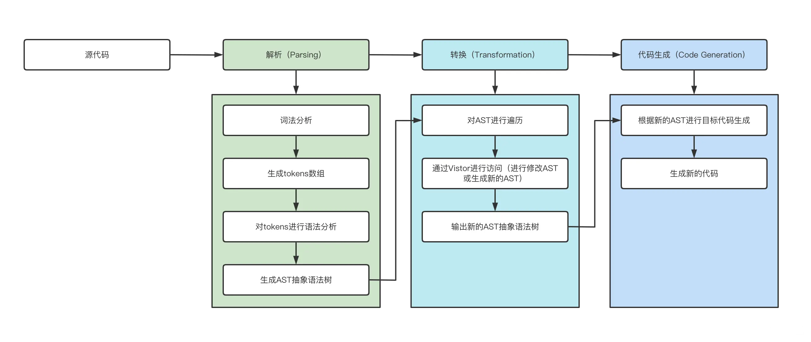
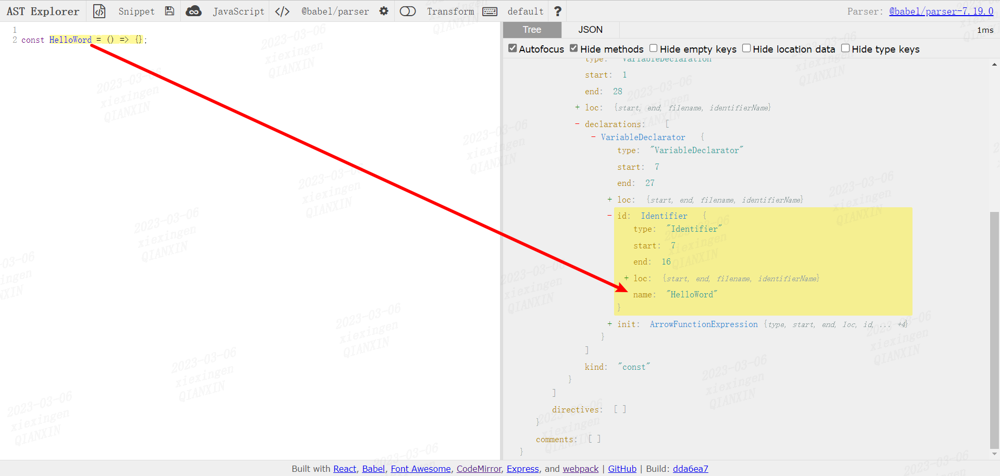
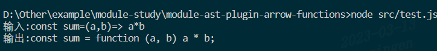
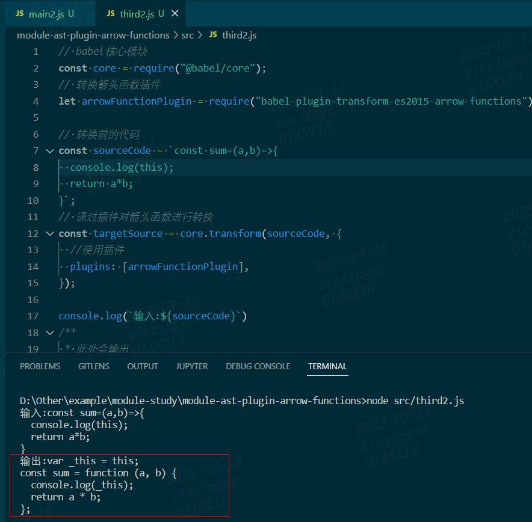
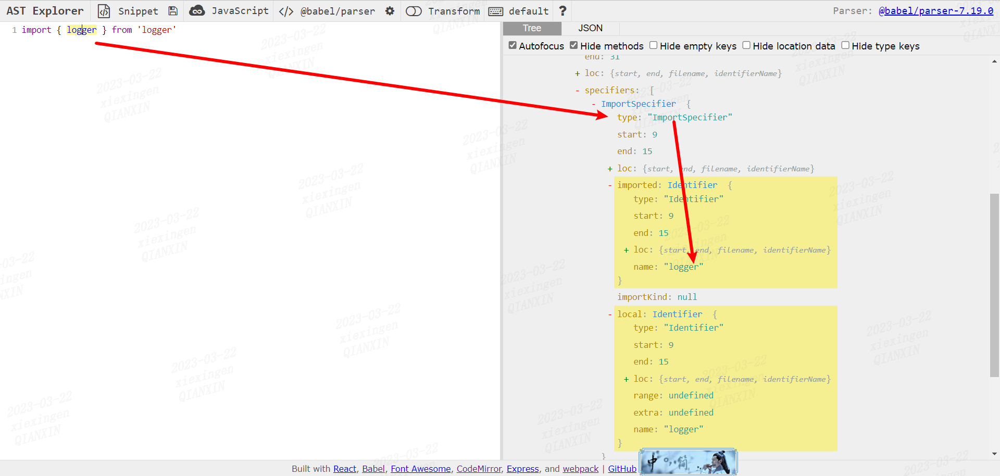
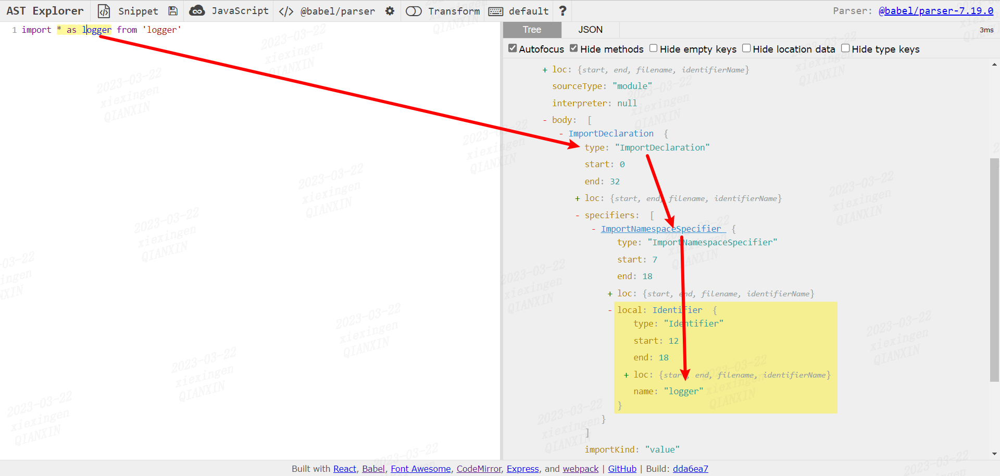
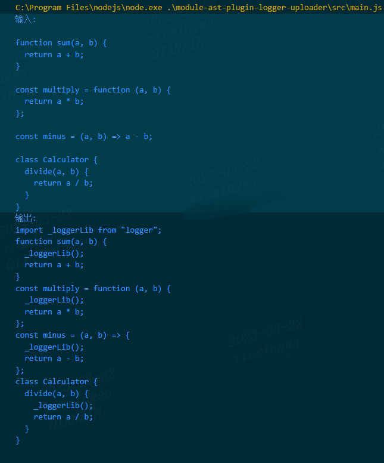

# AST 介绍

AST 的全称为: Abstract Syntax Tree,在我们这个国家管这叫 `抽象语法树`,下面围绕这些话题来讨论

- AST 是什么
- AST 基础: 从零到一手写一个功能的编译器
- AST 基础: Babel 的设计理念
- AST 应用: 手写 console 插件
- AST 应用: ES6 是如何转成 ES5 的
- AST 应用: 依靠 AST 实现代码压缩
- AST 应用: ESLint 的工作原理
- AST 应用: 手写按需加载插件
- AST 应用: 手写 Typescript 代码检测插件(fork-ts-checker-webpack-plugin)
- AST 延伸: 结合 AST 手写监控系统中的日志上传插件
- AST 延伸: 玩转 AST 最佳实践

## AST 是什么

`AST`(抽象语法树)是源代码语法结构的一种抽象表示,它以树状的形式表现编程语言的语法结构,树上的每个节点都表示源代码中的一种结构)在代码语法的检查、代码风格的检查、代码的格式化、代码的高亮、代码错误提示、代码自动补全等等场景均有广泛的应用)

以前我们在做小学语文题时,经常会做到的一种题型就是在一句话中找出不恰当的部分,比如:"我是钢铁侠,"
解题方法通常是:

第一步:找出语句中的主语、谓语、宾语
第二步:找出语句中的形容词、动词、标点符号等进行分析

如果将其程序化,我们按照上面的方法可以先将其进行拆分成这样

```js
[
  { type: '主语', value: '我' },
  { type: '谓语', value: '是' },
  { type: '宾语', value: '钢铁侠' },
  { type: '标点符号', value: ',' },
];
```

在这一步的过程中通过分析我们可以发现错误(最后的逗号应该是句号)

接着再对主语、谓语、宾语中的词语进行依次分析,将数据结构整理成这样:

```js
{
  type: "语句",
  body: {
    type: "肯定陈述句",
    declarations: [
      {
        type: "声明",
        person: {
          type: "Identifier",
          name: "我",
        },
        name: {
          type: "animal",
          value: "钢铁侠",
        },
      },
    ],
  },
};
```

在上面这个简单的例子中,其实和 AST 的生成和应用就颇为相似,AST 是源代码的抽象语法结构的树状表现形式,简单点就是一个深度嵌套对象,这个对象能够描述我们书写代码的所有信息)

## 从零到一手写一个功能的编译器

该小节分为两个部分:设计篇和原理篇
设计篇侧重整体设计,原理篇则是手撕代码,侧重编码实现,在阅读过程中建议将重心放在设计篇,学习思想最重要)

### 原理篇

#### 整体流程

一个完整的编译器整体执行过程可以分为三个步骤:

1. Parsing(解析过程)

这个过程要经词法分析、语法分析、构建 AST(抽象语法树) 一系列操作

2. Transformation(转化过程)

这个过程就是将上一步解析后的内容,按照编译器指定的规则进行处理,形成一个新的表现形式

3. Code Generation(代码生成)

将上一步处理好的内容转化为新的代码

如图所示



看一个小 Demo,将 [lisp](<https://en.wikipedia.org/wiki/Lisp_(programming_language)>) 的函数调用编译成类似 [C](https://zh.wikipedia.org/wiki/C%E8%AF%AD%E8%A8%80) 的函数,如果你不熟悉也没关系,看完下面的代码相信大家能够快速的理解:

```bash
LISP 代码: (add 2 (subtract 4 2))
C    代码  add(2, subtract(4, 2))
释义: 2 + ( 4 - 2 )
```

#### 解析(Parsing)

解析过程分为 2 个步骤:`词法分析`、`语法解析`)

##### 词法分析

`词法分析` 是使用 `tokenizer(分词器)`或者 `lexer(词法分析器)`,将源码拆分成 `tokens`,tokens 是一个放置对象的数组,其中的每一个对象都可以看做是一个单元(数字,标签,标点,操作符...)的描述信息)

结合最开始做的语文题目("我是钢铁侠,"),我们照葫芦画瓢,对(add 2 (subtract 4 2)) 进行词法分析后得到:

```js
[
  { type: 'paren', value: '(' },
  { type: 'name', value: 'add' },
  { type: 'number', value: '2' },
  { type: 'paren', value: '(' },
  { type: 'name', value: 'subtract' },
  { type: 'number', value: '4' },
  { type: 'number', value: '2' },
  { type: 'paren', value: ')' },
  { type: 'paren', value: ')' },
];
```

像这样对中文语句进行了主谓宾的拆解得到了 `tokens`,但这并不能帮助我们判断该条语句是否合法,还需要进行语法解析

##### 语法解析

`语法解析` 将词法解析生成的`tokens`重新整理成语法相互关联的表达形式,这种表达形式一般被称为中间层或者 AST(抽象语法树)

还是拿语文题目("我是钢铁侠,")来照葫芦画瓢,(add 2 (subtract 4 2)) 进行语法解析后得到的 AST:

```json
{
  "type": "Program",
  "body": [
    {
      "type": "CallExpression",
      "name": "add",
      "params": [
        {
          "type": "NumberLiteral",
          "value": "2"
        },
        {
          "type": "CallExpression",
          "name": "subtract",
          "params": [
            {
              "type": "NumberLiteral",
              "value": "4"
            },
            {
              "type": "NumberLiteral",
              "value": "2"
            }
          ]
        }
      ]
    }
  ]
}
```

#### 转换(Transformation)

这个过程主要是改写 AST(抽象语法树),或者根据当前 AST(抽象语法树)生成一个新的 AST(抽象语法树),这个过程可以是相同语言,或者可以直接将 AST(抽象语法树)翻译为其他语言)
注意看上述生成的 AST(抽象语法树),有一些特殊的对象,都具有自己的类型描述,他们就是这个"树"上的节点,如下所示

```js
// 数字片段节点
{
  type: 'NumberLiteral',
  value: '2',
}

// 调用语句节点
{
  type: 'CallExpression',
  name: 'subtract',
  params: [{
    type: 'NumberLiteral', // 数字片段节点
    value: '4',
  }, {
    type: 'NumberLiteral', // 数字片段节点
    value: '2',
  }]
}
```

在案例中我们是想将 [lisp](<https://en.wikipedia.org/wiki/Lisp_(programming_language)>) 语言转化为 [C](https://zh.wikipedia.org/wiki/C%E8%AF%AD%E8%A8%80) 语言,因此需要构建一个新的 AST(抽象语法树),这个创建的过程就需要遍历这个"树"的节点并读取其内容,由此引出 Traversal(遍历) 和 Visitors (访问器)

- Traversal(遍历)

顾名思义这个过程就是,遍历这个 AST(抽象语法树)的所有节点,这个过程使用 [深度优先](https://zhuanlan.zhihu.com/p/33340701)原则,大概执行顺序如下:


```bash
进入Program - 最顶层开始
   进入CallExpression (add)
      进入NumberLiteral (2)
      离开NumberLiteral (2)
      进入CallExpression (subtract)
         进入NumberLiteral (4)
         离开NumberLiteral (4)
         进入NumberLiteral (2)
         离开NumberLiteral (2)
      离开CallExpression (subtract)
   离开CallExpression (add)
离开Program
```

- Visitors (访问器)

访问器最基本的思想是创建一个"访问器"对象,这个对象可以处理不同类型的节点函数,如下所示

```js
const visitor = {
  NumberLiteral(node, parent) {}, // 处理数字类型节点
  CallExpression(node, parent) {}, // 处理调用语句类型节点
};
```

在遍历节点的时候,当进入到该节点,我们会调用访问器,然后会调用针对于这个节点的相关函数,同时这个节点和其父节点作为参数传入)

同时在离开的时候我们也希望能够调用访问器,当进入一个节点的时候,最外层节点就相当于一个分支,他是一个节点,这个分支的内部依然存在若干节点,就像上边遍历的那样)

我们会按照深度优先的原则,依次遍历到这个分支的最内层,当达到最内层的时候,针对当前分支的访问就完成了,接着会依次退出节点,这个过程是由内向外的)

为了能够处理到`进入`和`退出`,访问器最终会做成这个样子

```js
const visitor = {
  NumberLiteral: {
    enter(node, parent) {},
    exit(node, parent) {},
  },
};
```

#### 代码生成(CodeGeneration)

最后就是代码生成阶段了,其实就是将生成的新 AST 树再转回代码的过程)大部分的代码生成器主要过程是,不断的访问`Transformation`生成的 AST(抽象语法树)或者再结合 tokens,按照指定的规则,将"树"上的节点打印拼接最终还原为新的 code,自此编译器的执行过程就结束了)

### 实战篇幅

按照上述步骤,开始手写编译器

#### 生成 Tokens

第一步: 将代码解析为 tokens)这个过程需要 tokenzier(分词器)函数,整体思路就是通过遍历字符串的方式,对每个字符按照一定的规则进行 switch case,最终生成 tokens 数组

```js
function tokenizer(input) {
  let current = 0; //记录当前访问的位置
  let tokens = []; // 最终生成的tokens
  // 循环遍历input
  while (current < input.length) {
    let char = input[current];
    // 如果字符是开括号,我们把一个新的token放到tokens数组里,类型是`paren`
    if (char === '(') {
      tokens.push({
        type: 'paren',
        value: '(',
      });
      current++;
      continue;
    }
    // 闭括号做同样的操作
    if (char === ')') {
      tokens.push({
        type: 'paren',
        value: ')',
      });
      current++;
      continue;
    }
    //空格检查,我们关心空格在分隔字符上是否存在,但是在token中他是无意义的
    let WHITESPACE = /\s/;
    if (WHITESPACE.test(char)) {
      current++;
      continue;
    }
    //接下来检测数字,这里解释下 如果发现是数字我们如 add 22 33 这样
    //我们是不希望被解析为2、2、3、3这样的,我们要遇到数字后继续向后匹配直到匹配失败
    //这样我们就能截取到连续的数字了
    let NUMBERS = /[0-9]/;
    if (NUMBERS.test(char)) {
      let value = '';
      while (NUMBERS.test(char)) {
        value += char;
        char = input[++current];
      }
      tokens.push({ type: 'number', value });
      continue;
    }

    // 接下来检测字符串,这里我们只检测双引号,和上述同理也是截取连续完整的字符串
    if (char === '"') {
      let value = '';
      char = input[++current];
      while (char !== '"') {
        value += char;
        char = input[++current];
      }
      char = input[++current];
      tokens.push({ type: 'string', value });
      continue;
    }
    // 最后一个检测的是name 如add这样,也是一串连续的字符,但是他是没有""的
    let LETTERS = /[a-z]/i;
    if (LETTERS.test(char)) {
      let value = '';
      while (LETTERS.test(char)) {
        value += char;
        char = input[++current];
      }
      tokens.push({ type: 'name', value });
      continue;
    }
    // 容错处理,如果我们什么都没有匹配到,说明这个token不在我们的解析范围内
    throw new TypeError('I dont know what this character is: ' + char);
  }
  return tokens;
}
```

#### 生成 AST

第二步: 将生成好的 tokens 转化为 AST)现在需要定义 parser 函数,接收上一步处理好的 tokens

```js
function parser(tokens) {
  let current = 0; //访问tokens的下标

  //walk函数辅助我们遍历整个tokens
  function walk() {
    let token = tokens[current];
    // 现在就是遍历出每一个token,根据其类型生成对应的节点
    if (token.type === 'number') {
      current++;
      return {
        type: 'NumberLiteral',
        value: token.value,
      };
    }
    if (token.type === 'string') {
      current++;
      return {
        type: 'StringLiteral',
        value: token.value,
      };
    }
    //这里处理调用语句
    if (token.type === 'paren' && token.value === '(') {
      token = tokens[++current];
      //这里以一个例子解释(add 2 3) 这样的代码 "(" 就是 paren token,而接下来的node其实就是那个 name 类型的token "add"
      let node = {
        type: 'CallExpression',
        value: token.value,
        params: [],
      };
      //获取name后我们需要继续获取接下来调用语句中的参数,直到我们遇到了")",这里会存在嵌套的现象如下
      // (add 2 (subtract 4 2))
      /*
        [
          { type: 'paren', value: '(' },
          { type: 'name', value: 'add' },
          { type: 'number', value: '2' },
          { type: 'paren', value: '(' },
          { type: 'name', value: 'subtract' },
          { type: 'number', value: '4' },
          { type: 'number', value: '2' },
          { type: 'paren', value: ')' },
          { type: 'paren', value: ')' },
        ]
      */
      token = tokens[++current];
      //这里我们通过递归调用不断的读取参数
      while (
        token.type !== 'paren' ||
        (token.type === 'paren' && token.value !== ')')
      ) {
        node.params.push(walk());
        token = tokens[current]; //因为参数的if判断里会让 current++ 实际上就是持续向后遍历了tokens,然后将参数推入params
      }
      // 当while中断后就说明参数读取完了,现在下一个应该是")",所以我们++越过
      current++;
      return node; // 最终将CallExpression节点返回了
    }
    //当然这里做了容错处理,如果没有匹配到预计的类型,就说明出现了,parse无法识别的token
    throw new TypeError(token.type);
  }
  // 现在我们创建AST,树的最根层就是Program
  let ast = {
    type: 'Program',
    body: [],
  };
  //然后我们通过调用walk遍历tokens将tokens内的对象,转化为AST的节点,完成AST的构建
  while (current < tokens.length) {
    ast.body.push(walk());
  }
  return ast;
}
```

#### 遍历和访问生成好的 AST

现在已经有 AST 了,然后我们希望能够通过访问器访问不同的节点,当遇到不同的节点的时候,调用访问器的不同函数,大致设计成这样

```js
//  traverse(ast,visitor) 迭代器(抽象语法树,访问器)
traverse(ast, {
  Program: {
    enter(node, parent) {
      // ...
    },
    exit(node, parent) {
      // ...
    },
  },
  CallExpression: {
    enter(node, parent) {
      // ...
    },
    exit(node, parent) {
      // ...
    },
  },
  NumberLiteral: {
    enter(node, parent) {
      // ...
    },
    exit(node, parent) {
      // ...
    },
  },
});
```

接下来实现 traverse 函数

```js
function traverse(ast, visitor) {
  //遍历数组,在遍历数组的同时会调用traverseNode来遍历节点
  function traverseArray(array, parent) {
    array.forEach((child) => {
      traverseNode(child, parent);
    });
  }
  function traverseNode(node, parent) {
    // 判断访问器中是否有合适处理该节点的函数
    let methods = visitor[node.type];
    // 如果有就执行enter函数,因为此时已经进入这个节点了
    if (methods && methods.enter) {
      methods.enter(node, parent);
    }
    //接下来就根据node节点类型来处理了
    switch (node.type) {
      case 'Program':
        traverseArray(node.body, node); //如果你是ast的根部,就相当于树根,body中的每一项都是一个分支
        break;
      case 'CallExpression':
        traverseArray(node.params, node); //这个和Program一样处理,但是这里是为了遍历params,上面是为了遍历分支
        break;
      // 字符串和数字没有子节点需要访问直接跳过
      case 'NumberLiteral':
      case 'StringLiteral':
        break;
      // 最后容错处理
      default:
        throw new TypeError(node.type);
    }
    // 当执行到这里时,说明该节点(分支)已经遍历到尽头了,执行exit
    if (methods && methods.exit) {
      methods.exit(node, parent);
    }
  }
  //我们从ast开始进行节点遍历,因为ast没有父节点所以传入null
  traverseNode(ast, null);
}
```

#### Transformer 转化

现在已经生成好 AST 了)在这一步需要使用到转换器,帮助我们将刚才生成的 AST 转化为新的 AST)在转化之前,必须要明确转化后的 AST 长什么样,记得之前的案例

```bash
LISP 代码 (add 2 (subtract 4 2))
C    代码  add(2, subtract(4, 2))
```

将原来的 AST 转化为目标 AST,数据结构如下

```bash
*   Original AST                     |   Transformed AST
* ----------------------------------------------------------------------------
*   {                                |   {
*     type: 'Program',               |     type: 'Program',
*     body: [{                       |     body: [{
*       type: 'CallExpression',      |       type: 'ExpressionStatement',
*       name: 'add',                 |       expression: {
*       params: [{                   |         type: 'CallExpression',
*         type: 'NumberLiteral',     |         callee: {
*         value: '2'                 |           type: 'Identifier',
*       }, {                         |           name: 'add'
*         type: 'CallExpression',    |         },
*         name: 'subtract',          |         arguments: [{
*         params: [{                 |           type: 'NumberLiteral',
*           type: 'NumberLiteral',   |           value: '2'
*           value: '4'               |         }, {
*         }, {                       |           type: 'CallExpression',
*           type: 'NumberLiteral',   |           callee: {
*           value: '2'               |             type: 'Identifier',
*         }]                         |             name: 'subtract'
*       }]                           |           },
*     }]                             |           arguments: [{
*   }                                |             type: 'NumberLiteral',
*                                    |             value: '4'
* ---------------------------------- |           }, {
*                                    |             type: 'NumberLiteral',
*                                    |             value: '2'
*                                    |           }]
*                                    |         }
*                                    |       }
*                                    |     }]
*                                    |   }
```

具体代码实现

```js
function transformer(ast) {
  // 将要被返回的新的AST
  let newAst = {
    type: 'Program',
    body: [],
  };
  // 这里相当于将在旧的AST上创建一个_content,这个属性就是新AST的body,因为是引用,所以后面可以直接操作就的AST
  ast._context = newAst.body;
  // 用之前创建的访问器来访问这个AST的所有节点
  traverser(ast, {
    // 针对于数字片段的处理
    NumberLiteral: {
      enter(node, parent) {
        // 创建一个新的节点,其实就是创建新AST的节点,这个新节点存在于父节点的body中
        parent._context.push({
          type: 'NumberLiteral',
          value: node.value,
        });
      },
    },

    // 针对于文字片段的处理
    StringLiteral: {
      enter(node, parent) {
        parent._context.push({
          type: 'StringLiteral',
          value: node.value,
        });
      },
    },

    // 对调用语句的处理
    CallExpression: {
      enter(node, parent) {
        // 在新的AST中如果是调用语句,type是`CallExpression`,同时他还有一个`Identifier`,来标识操作
        let expression = {
          type: 'CallExpression',
          callee: {
            type: 'Identifier',
            name: node.value,
          },
          arguments: [],
        };
        // 在原来的节点上再创建一个新的属性,用于存放参数 这样当子节点修改_context时,会同步到expression.arguments中,这里用的是同一个内存地址
        node._context = expression.arguments;
        // 这里需要判断父节点是否是调用语句,如果不是,那么就使用`ExpressionStatement`将`CallExpression`包裹,因为js中顶层的`CallExpression`是有效语句
        if (parent.type !== 'CallExpression') {
          expression = {
            type: 'ExpressionStatement',
            expression: expression,
          };
        }
        parent._context.push(expression);
      },
    },
  });
  return newAst;
}
```

#### 新代码生成

最后一步: 新代码生成)到这一步就是用新的 AST,遍历其每一个节点,根据指定规则生成最终新的代码

```js
function codeGenerator(node) {
  // 我们以节点的种类拆解(语法树)
  switch (node.type) {
    // 如果是Progame,那么就是AST的最根部了,他的body中的每一项就是一个分支,我们需要将每一个分支都放入代码生成器中
    case 'Program':
      return node.body.map(codeGenerator).join('\n');
    // 如果是声明语句注意看新的AST结构,那么在声明语句中expression,就是声明的标示,我们以他为参数再次调用codeGenerator
    case 'ExpressionStatement':
      return codeGenerator(node.expression) + ';';
    // 如果是调用语句,我们需要打印出调用者的名字加括号,中间放置参数如生成这样"add(2,2)",
    case 'CallExpression':
      return (
        codeGenerator(node.callee) +
        '(' +
        node.arguments.map(codeGenerator).join(', ') +
        ')'
      );

    // 如果是识别就直接返回值 如: (add 2 2),在新AST中 add就是那个identifier节点
    case 'Identifier':
      return node.name;
    // 如果是数字就直接返回值
    case 'NumberLiteral':
      return node.value;
    // 如果是文本就给值加个双引号
    case 'StringLiteral':
      return '"' + node.value + '"';
    // 容错处理
    default:
      throw new TypeError(node.type);
  }
}
```

最终按照上面的步骤实现 compiler 完成这个微型编译器,注意这个过程的顺序

```js
function compiler(input) {
  let tokens = tokenizer(input); //生成tokens
  let ast = parser(tokens); //生成ast
  let newAst = transformer(ast); //拿到新的ast
  let output = codeGenerator(newAst); //生成新代码
  return output;
}
```

现在一个小型的编译器就完整实现了,我们来测试一下

```bash
const input="(add 2(subtract 4 2))";
console.log(compiler(input))
```

附上[案例源码](https://github.com/xiexingen/module-study/tree/main/module-ast)

## AST 的广泛应用

我们先来了解一下 [Babel](https://babeljs.io/docs/) 是什么

[Babel](https://babeljs.io/docs/) 其实就是一个最常用的 Javascript 编译器,它能够转译  `ECMAScript 2015+`  的代码,使它在旧的浏览器或者环境中也能够运行,工作过程分为三个部分（其实就跟我们上面手写的一样,相信大家现在肯定倍感亲切）:

- Parse(解析)
  将源代码转换成抽象语法树,树上有很多的 estree 节点
- Transform(转换)
  对抽象语法树进行转换
- Generate(代码生成)
  将上一步经过转换过的抽象语法树生成新的代码

当然我们现在不用从零开始手写了,可以借助于 `babel` 插件:

[@babel/parser](https://github.com/babel/babel/tree/main/packages/babel-parser)  可以把源码转换成 `AST`

[@babel/traverse](https://www.npmjs.com/package/babel-traverse) 用于对 `AST` 的遍历,维护了整棵树的状态,并且负责替换、移除和添加节点

[@babel/generate](https://github.com/babel/babel/tree/main/packages/babel-generator)  可以把 `AST` 生成源码,同时生成 `sourcemap`

[@babel/types](https://github.com/babel/babel/tree/main/packages/babel-types)  用于 `AST` 节点的 `Lodash` 式工具库, 它包含了构造、验证以及变换 `AST` 节点的方法,对编写处理 AST 逻辑非常有用

[@babel/core](https://github.com/babel/babel/tree/main/packages/babel-core)` Babel` 的编译器,核心 `API` 都在这里面,比如常见的 `transform`、`parse`,并实现了插件功能

先安装:

```bash
yarn add @babel/core -D // 里面就包含了@babel/parser、@babel/traverse、@babel/generate、@babel/types等
```

### 青铜:使用 Babel 修改函数命名风格

要求:借助 [Babel](https://babeljs.io/docs/en/) 给函数实现首字母小写命名

```js
//源代码
const HelloWord = () => {};
//需要修改为:
const helloWord = () => {};
```

根据前面学过的知识点,我们先来整理下思路:

1. 先将源代码转化成 AST
2. 遍历 AST 上的节点,找到 函数名节点并修改
3. 将转换过的 AST 再生成 JS 代码

将源代码拷贝到 [在线 ast 转换器](https://astexplorer.net/) 中,查看 HelloWord 函数名节点:



我们只需要将这个名称改成首字母小写命名即可

```js
const parser = require('@babel/parser');
const traverse = require('@babel/traverse');
const generator = require('@babel/generator');

// 源代码
const code = `const HelloWord = () => {};`;

// 1. 源代码解析成 ast
const ast = parser.parse(code);

// 2. 转换
const visitor = {
  // traverse 会遍历树节点,只要节点的 type 在 visitor 对象中出现,变化调用该方法
  Identifier(path) {
    const { node } = path; //从path中解析出当前 AST 节点
    // 将 name 转成首字母小写
    node.name = `${node.name.slice(0, 1).toLocaleLowerCase()}${node.name.slice(
      1,
    )}`; //找到hello的节点,替换成world
  },
};
traverse.default(ast, visitor);

// 3. 生成
const result = generator.default(ast, {}, code);

console.log(result.code); //const helloWorld = () => {};
```

附上[案例源码](https://github.com/xiexingen/module-study/tree/main/module-ast-plugin-lower-first)

### 白银:手写简易版 babel-plugin-transform-es2015-arrow-functions

接下来尝试稍微难度大一点的，手写箭头函数转换插件 [babel-plugin-transform-es2015-arrow-functions](https://www.npmjs.com/package/babel-plugin-transform-es2015-arrow-functions)，将箭头函数转换为普通函数

#### 使用插件

先体验下使用插件的情况，安装依赖

```bash
// @babel/core 为核心模块，前面已经介绍过
// babel-plugin-transform-es2015-arrow-functions 就是将箭头函数转换成普通函数的插件
yarn add @babel/core babel-plugin-transform-es2015-arrow-functions -D
```

使用代码如下所示

```js
//babel核心模块
const core = require('@babel/core');
//转换箭头函数插件
let arrowFunctionPlugin = require('babel-plugin-transform-es2015-arrow-functions');

// 转换前的代码
const sourceCode = `const sum=(a,b)=>{ return a*b; }`;
// 通过插件对箭头函数进行转换
const targetSource = core.transform(sourceCode, {
  //使用插件
  plugins: [arrowFunctionPlugin],
});
/**
 * 此处会输出
 * const sum = function (a, b) {
  return a * b;
};
 */
console.log(targetSource.code);
```

附上[案例源码](https://github.com/xiexingen/module-study/blob/main/module-ast-plugin-arrow-functions/src/third.js)

#### 自己实现插件

接下来我们就来照着写一个类似的`Babel`插件。所谓的`Babel`插件其实是一个对象，对象里面有一个`visitor`属性，它也是一个对象，key 为类型，value 为函数，接受 path 作为参数。也就是这样

```js
const arrowFunctionPlugin = {
  visitor: {
    [type]: (path) => {
      //.....
    },
  },
};
```

好了，进入正题。在写箭头函数转换插件之前，我们首先得知道代码转换前后的区别。还是通过 [astexplorer.net](https://astexplorer.net/) 这个网站去比较，经过比较分析，发现箭头函数和普通函数除了类型不一样，其他都一样。


我们直接修改类型尝试一下

```js
// babel核心模块
const core = require('@babel/core');
// 转换前的代码
const sourceCode = `const sum=(a,b)=>{ return a*b; }`;
// 定义转换的插件
const arrowFunctionPlugin = {
  visitor: {
    // 如果是箭头函数，那么就会进来此函数，参数是箭头函数的节点路径对象
    ArrowFunctionExpression(path) {
      let { node } = path;
      node.type = 'FunctionExpression';
    },
  },
};
// 通过插件对箭头函数进行转换
const targetSource = core.transform(sourceCode, {
  //使用插件
  plugins: [arrowFunctionPlugin],
});

/**
 * 此处会输出(符合我们的期望)
 * const sum = function (a, b) {
  return a * b;
};
 */
console.log(targetSource.code);
```

附上[案例源码](https://github.com/xiexingen/module-study/blob/main/module-ast-plugin-arrow-functions/src/simple.js)

### 黄金:手写复杂版 babel-plugin-transform-es2015-arrow-functions

在上面的基础上我们还有一些场景没考虑进来:

- 箭头函数的简单写法怎么处理？
- 箭头函数中的 this 怎么处理？

先看看箭头函数的简单写法

```js
const sum = (a, b) => a + b; // 我们发现没有大括号
```

如果还是使用上面写的插件进行转换:



结果肯定是不对的，转换后的代码缺少一对大括号，还缺少 return 关键字。

附上[案例源码] (https://github.com/xiexingen/module-study/blob/main/module-ast-plugin-arrow-functions/src/test.js)

解决思路: 先判断要转换的函数体是不是一个块语句，如果是就不处理，不是就生成一个块语句，将我们的代码添加到这个块里面去。在添加的过程中还需要在原代码中添加 return 关键字

在这过程中需要用到两个 api：[blockStatement](https://babeljs.io/docs/babel-types#blockstatement) 、[returnStatement](https://babeljs.io/docs/babel-types#returnstatement)，可以用它们来生成节点或判断节点

上代码

```js
// babel核心模块
const core = require('@babel/core');
// 转换箭头函数插件,我们将之前的插件注释掉，自己实现插件部分
// let arrowFunctionPlugin = require("babel-plugin-transform-es2015-arrow-functions");

//用来生成或者判断节点的AST语法树的节点
const types = require('@babel/types');

const arrowFunctionPlugin = {
  visitor: {
    //如果是箭头函数，那么就会进来此函数，参数是箭头函数的节点路径对象
    ArrowFunctionExpression(path) {
      const { node } = path;
      node.type = 'FunctionExpression';
      // 如果函数体不是块语句,生成一个块语句，并将内容return
      if (!types.isBlockStatement(node.body)) {
        const statementBody = types.returnStatement(node.body);
        node.body = types.blockStatement([statementBody]);
      }
    },
  },
};

// 转换前的代码,我们换成简写形式
// const sourceCode = `const sum=(a,b)=>{ return a*b; }`;
const sourceCode = `function (a, b) {
  return a * b;
}`;
// 通过插件对箭头函数进行转换
const targetSource = core.transform(sourceCode, {
  //使用插件
  plugins: [arrowFunctionPlugin],
});

console.log(`输入:${sourceCode}`);
/**
 * 此处会输出
 * const sum = function (a, b) a * b;
 */
console.log(`输出:${targetSource.code}`);
```

附上[案例源码](https://github.com/xiexingen/module-study/blob/main/module-ast-plugin-arrow-functions/src/simple2.js)

再来看如果存在 this 的情况，原插件 [babel-plugin-transform-es2015-arrow-functions](https://www.npmjs.com/package/babel-plugin-transform-es2015-arrow-functions) 转换后的结果



老规矩，我们先得知道转化后的代码的`AST`和源代码的`AST`之间的差异，大家可以自己动手看一看比较一下。

整体思路：

第一步:找到当前箭头函数要使用哪个作用域内的 this，暂时称为父作用域
第二步:往父作用域中加入\_this 变量，也就是添加语句：var \_this = this
第三步:找出当前箭头函数内所有用到 this 的地方
第四步:将当前箭头函数中的 this，统一替换成\_this

#### 找到当前箭头函数要使用哪个作用域内的 this

具体思路：`从当前节点开始向上查找，直到找到一个不是箭头函数的函数，最后还找不到那就是根节点`

新增 `hoistFunctionEnvironment`函数：

```js
// 处理 this 作用域
function hoistFunctionEnvironment(path) {
  // 1.找到当前箭头函数要使用哪个作用域内的this
  // 确定当前箭头函数要使用哪个地方的this,要求父节点是函数且不是箭头函数，找不到就返回根节点
  const thisScope = path.findParent((parent) => {
    return (
      (parent.isFunction() && parent.isArrowFunctionExpression() === false) ||
      parent.isProgram()
    );
  });
  // TODO
}

const arrowFunctionPlugin = {
  visitor: {
    //如果是箭头函数，那么就会进来此函数，参数是箭头函数的节点路径对象
    ArrowFunctionExpression(path) {
      let { node } = path;
      //提升函数环境，解决this作用域问题
      +hoistFunctionEnvironment(path);
      //箭头函数转换为普通函数
      node.type = 'FunctionExpression';
      //如果函数体不是块语句
      if (!types.isBlockStatement(node.body)) {
        node.body = types.blockStatement([types.returnStatement(node.body)]);
      }
    },
  },
};
```

#### 往父作用域中加入\_this 变量

这里需要引入作用域（scope）的概念。大家都知道 JavaScript 拥有词法作用域，即代码块创建新的作用域会形成一个树状结构，它与别的作用域之间相互隔离不受影响。作用域（scope）同样如此，我们得确保在改变代码的各个部分时不会破坏其他的部分

作用域（scope）的大致结构：

```js
{
  path: path,
  block: path.node,
  parentBlock: path.parent,
  parent: parentScope,
  bindings: [...]
}
```

这一步比较简单，要想在作用域中加一个\_this 变量，其实就是对 AST 树中的（scope）新增一个节点即可。

```js
function hoistFunctionEnvironment(path) {
  // 1.找到当前箭头函数要使用哪个作用域内的this
  // 确定当前箭头函数要使用哪个地方的this,要求父节点是函数且不是箭头函数，找不到就返回根节点
  const thisScope = path.findParent((parent) => {
    return (
      (parent.isFunction() && parent.isArrowFunctionExpression() === false) ||
      parent.isProgram()
    );
  });

  // 2. 向父作用域内放入一个_this变量
  // 在作用域中加一个_this变量，其实就是对AST树中的（scope）新增一个节点即可
  thisScope.scope.push({
    id: types.identifier('_this'), //生成标识符节点,也就是变量名
    init: types.thisExpression(), //生成this节点 也就是变量值
  });
  // TODO
}
```

#### 找出当前箭头函数内所有用到 this 的地方

思路：遍历当前节点的子节点，如果有 this 变量，就收集起来。

```js
function hoistFunctionEnvironment(path) {
  // 1.找到当前箭头函数要使用哪个作用域内的this
  // 确定当前箭头函数要使用哪个地方的this,要求父节点是函数且不是箭头函数，找不到就返回根节点
  const thisScope = path.findParent((parent) => {
    return (
      (parent.isFunction() && parent.isArrowFunctionExpression() === false) ||
      parent.isProgram()
    );
  });

  // 2. 向父作用域内放入一个_this变量
  // 在作用域中加一个_this变量，其实就是对AST树中的（scope）新增一个节点即可
  thisScope.scope.push({
    id: types.identifier('_this'), //生成标识符节点,也就是变量名
    init: types.thisExpression(), //生成this节点 也就是变量值
  });

  // 3. 找出当前箭头函数内所有用到this的地方
  // 遍历当前节点的子节点，如果有this变量，就收集起来
  const thisScopePaths = []; //获取当前节点this的路径
  //遍历当前节点的子节点
  path.traverse({
    // 跟前面一样，如果是 ThisExpress 类型就收集起来
    ThisExpression(thisPath) {
      thisScopePaths.push(thisPath);
    },
  });
  // TODO
}
```

#### 将当前箭头函数中的 this，统一替换成\_this

```js
function hoistFunctionEnvironment(path) {
  // 1.找到当前箭头函数要使用哪个作用域内的this
  // 确定当前箭头函数要使用哪个地方的this,要求父节点是函数且不是箭头函数，找不到就返回根节点
  const thisScope = path.findParent((parent) => {
    return (
      (parent.isFunction() && parent.isArrowFunctionExpression() === false) ||
      parent.isProgram()
    );
  });

  // 2. 向父作用域内放入一个_this变量
  // 在作用域中加一个_this变量，其实就是对AST树中的（scope）新增一个节点即可
  thisScope.scope.push({
    id: types.identifier('_this'), //生成标识符节点,也就是变量名
    init: types.thisExpression(), //生成this节点 也就是变量值
  });

  // 3. 找出当前箭头函数内所有用到this的地方
  // 遍历当前节点的子节点，如果有this变量，就收集起来
  const thisScopePaths = []; //获取当前节点this的路径
  //遍历当前节点的子节点
  path.traverse({
    // 跟前面一样，如果是 ThisExpress 类型就收集起来
    ThisExpression(thisPath) {
      thisScopePaths.push(thisPath);
    },
  });

  // 4.将当前箭头函数中的this，统一替换成_this
  thisScopePaths.forEach((thisPath) => {
    thisPath.replaceWith(types.identifier('_this')); // 将this改成_this
  });
}
```

附上[案例源码](https://github.com/xiexingen/module-study/blob/main/module-ast-plugin-arrow-functions/src/main.js)

### 铂金:手写 plus 版日志记录插件

场景：在开发阶段，我们通常会打印一些 console.log 进行调试。但随着项目的日常迭代，console.log 也越来越多，有时候控制台打印了一大堆，不能第一时间定位到想要的日志。这个时候希望可以通过一个插件强化 console，让其也打印出当前文件名，以及打印地方的行和列等代码信息。

经过分析，其实就是往 console.log 中添加几个参数，比如源代码：

```js
const logPlus = (log) => {
  console.log(log);
};
```

打印的时候期望变成：

```js
const logPlus = (log) => {
  console.log(log, '当前行列', '文件名');
};
```

对比两个的 AST 数，经过对比发现只是 arguments 略有不同，我们只需处理这一块即可：


思路：

第一步：先找出 console 节点的部分
第二步：判断是否是这几个方法名中的某一个："log"、"info"、"warn"、"error"
第三步：往节点的 arguments 中添加参数

```js
/**
 * 手写 console.log 增强插件，打印 log 的同时还能打印出当前文件名和代码的行列信息
 */

// babel核心模块
const core = require('@babel/core');
// 转换箭头函数插件,我们将之前的插件注释掉，自己实现插件部分

//用来生成或者判断节点的AST语法树的节点
const types = require('@babel/types');

/**
 * 思路
 * 1. 先找出console节点的部分
 * 2. 判断是否是这几个方法名中的某一个："log"、"info"、"warn"、"error"
 * 3. 往节点的arguments中添加参数
 */
const logPlusPlugin = {
  visitor: {
    CallExpression(path, state) {
      const { node } = path;
      // 1. 先找出console节点的部分
      if (types.isMemberExpression(node.callee)) {
        // 确定是 console
        if (node.callee.object.name === 'console') {
          // 2. 判断是否是这几个方法名中的某一个："log"、"info"、"warn"、"error"
          if (
            ['log', 'info', 'warn', 'error'].includes(node.callee.property.name)
          ) {
            // 3. 往节点的arguments中添加参数
            const { line, column } = node.loc.start; //找到所处位置的行和列
            node.arguments.push(types.stringLiteral(`${line}:${column}`)); //向右边添加我们的行和列信息
            //找到文件名
            const filename = state.file.opts.filename;
            //输出文件的相对路径
            const relativeName = pathLibrary
              .relative(__dirname, filename)
              .replace(/\\/g, '/'); //兼容window
            node.arguments.push(types.stringLiteral(relativeName)); //向右边添加我们的行和列信息
          }
        }
      }
    },
  },
};

// 转换前的代码,我们换成简写形式
const sourceCode = `const logPlus=(log)=>{
  console.log(log);
} `;

// 通过插件对箭头函数进行转换
const targetSource = core.transform(sourceCode, {
  //使用插件
  plugins: [logPlusPlugin],
  filename: 'main.js',
});

console.log(`输入:\r\n${sourceCode}`);
/**
 * 此处会输出
  const logPlus = log => {
    console.log(log, "2:2", "../main.js");
  };
 */
console.log(`输出:\r\n${targetSource.code}`);
```

附上[案例源码](https://github.com/xiexingen/module-study/tree/main/module-ast-plugin-console-log)

### 钻石:手写监控系统中的日志上传插件

场景：在监控系统的日志上传过程中，我们需要往每个函数的作用域中添加一行日志执行函数，也就是这样（但这里要注意的是，函数的定义方式总共有四种，都需要考虑进来）：

源代码：

```js
function sum(a, b) {
  return a + b;
}

const multiply = function (a, b) {
  return a * b;
};

const minus = (a, b) => a - b;

class Calculator {
  divide(a, b) {
    return a / b;
  }
}
```

期望转换后的代码：

```js
import loggerLib from 'logger';

function sum(a, b) {
  loggerLib();
  return a + b;
}
const multiply = function (a, b) {
  loggerLib();
  return a * b;
};
const minus = (a, b) => {
  loggerLib();
  return a - b;
};
class Calculator {
  divide(a, b) {
    loggerLib();
    return a / b;
  }
}
```

整体思路：

第一步：先判断源代码中是否引入了 logger 库
第二步：如果引入了，就找出导入的变量名，后面直接使用该变量名即可
第三步：如果没有引入我们就在源代码的顶部引用一下
第四步：在函数中插入引入的函数

第一步：先判断源代码中是否引入了 logger 库

导入的方式总共有三种：

```js
import logger from 'logger';
import { logger2 } from 'logger2';
import * as logger3 from 'logger3';
```

要判断源代码中有没有引入`logger`库，其实就是查找 `from` 节点后面有没有`logger`，老规矩，查看这三种导入方式的 AST：





发现不管哪种导入方式，我们都可以通过节点的`source.value`属性获取导入的库名，通过`specifiers.local.name`属性获取导入的变量名。上代码：

```js
/**
 * 手写监控系统中的日志上传插件
 */
// babel核心模块
const core = require('@babel/core');
//用来生成或者判断节点的AST语法树的节点
const types = require('@babel/types');

/**
 * 思路
 * 1. 先判断源代码中是否引入了 logger 库
 * 2. 如果引入了，就找出导入的变量名，后面直接使用该变量名即可
 * 3. 如果没有引入我们就在源代码的顶部引用一下
 * 4. 在函数中插入引入的函数
 */
const autoImportPlugin = {
  visitor: {
    Program(path, state) {
      let loggerId;
      //遍历子节点
      path.traverse({
        ImportDeclaration(path) {
          const { node } = path;
          // 1. 判断源代码中是否引入了 logger 库
          if (node.source.value === 'logger') {
            // 如果有说明导入过了
          }
        },
      });

      //3. 如果没有引入说明源代码中还没有导入此模块，需要我们手动插入一个import语句
      if (!loggerId) {
        // 如果没有就插入一个
      }
    },
  },
};
```

第二步：如果引入了，就找出导入的变量名，后面直接使用该变量名即可

这一步比较简单，直接通过`specifiers.local.name`属性获取导入的变量名再赋值即可

```js
/**
 * 手写监控系统中的日志上传插件
 */
// babel核心模块
const core = require("@babel/core");
//用来生成或者判断节点的AST语法树的节点
const types = require("@babel/types");

/**
 * 思路
 * 1. 先判断源代码中是否引入了 logger 库
 * 2. 如果引入了，就找出导入的变量名，后面直接使用该变量名即可
 * 3. 如果没有引入我们就在源代码的顶部引用一下
 * 4. 在函数中插入引入的函数
 */
const autoImportPlugin = {
  visitor: {
    Program(path, state) {
      let loggerId;
      //遍历子节点
      path.traverse({
        ImportDeclaration(path) {
          const { node } = path;
          // 1. 判断源代码中是否引入了 logger 库
          if (node.source.value === "logger") {
            // 2. 如果引入了，就找出导入的变量名，后面直接使用该变量名即可
+            const specifiers = node.specifiers[0];
+            loggerId = specifiers.local.name; //取出导入的变量名赋值给loggerId
+            //找到了就结束循环
+            path.stop();
          }
        },
      });

      //3. 如果没有引入说明源代码中还没有导入此模块，需要我们手动插入一个import语句
      if (!loggerId) {
        // 如果没有就插入一个
      }
    },
  },
};
```

第三步：如果没有引入我们就在源代码的顶部引用一下

```js
/**
 * 手写监控系统中的日志上传插件
 */
// babel核心模块
const core = require("@babel/core");
//用来生成或者判断节点的AST语法树的节点
const types = require("@babel/types");
// 用来生成模板代码
const template = require("@babel/template");

/**
 * 思路
 * 1. 先判断源代码中是否引入了 logger 库
 * 2. 如果引入了，就找出导入的变量名，后面直接使用该变量名即可
 * 3. 如果没有引入我们就在源代码的顶部引用一下
 * 4. 在函数中插入引入的函数
 */
const autoImportPlugin = {
  visitor: {
    Program(path, state) {
      let loggerId;
      //遍历子节点
      path.traverse({
        ImportDeclaration(path) {
          const { node } = path;
          // 1. 判断源代码中是否引入了 logger 库
          if (node.source.value === "logger") {
            // 2. 如果引入了，就找出导入的变量名，后面直接使用该变量名即可
            const specifiers = node.specifiers[0];
            loggerId = specifiers.local.name; //取出导入的变量名赋值给loggerId
            //找到了就结束循环
            path.stop();
          }
        },
      });

      //3. 如果没有引入说明源代码中还没有导入此模块，需要我们手动插入一个import语句
      if (!loggerId) {
        // 如果没有就插入一个
+        loggerId = path.scope.generateUid("loggerLib"); //防止变量名之间的冲突,使用提供的方法生成
+        path.node.body.unshift(
+          // types.importDeclaration(
+          //   [types.importDefaultSpecifier(types.identifier(loggerId))],
+          //   types.stringLiteral("logger")
+          // )
+          // 使用模板写法替换掉上面的写法
+          template.statement(`import ${loggerId} from 'logger'`)()
+        );
      }
    },
  },
};
```

第四步：在函数中插入引入的函数

思路：在获取 loggerLib()代码块的 AST，然后将其插入到函数的顶层。

这里需要考虑的是，函数共有四种声明方式，我们都需要考虑进来。

先生成 loggerLib()代码块的 AST：

```js
//loggerId就是loggerLib，第二个参数【】代表执行该函数无传参
types.expressionStatement(types.callExpression(types.identifier(loggerId), []));
```

我们可以将生成后的该节点挂载在 state 对象下，state 就是一个用来暂存数据的对象，是一个容器，用于共享数据

```js
/**
 * 手写监控系统中的日志上传插件
 */
// babel核心模块
const core = require("@babel/core");
//用来生成或者判断节点的AST语法树的节点
const types = require("@babel/types");
// 用来生成模板代码
const template = require("@babel/template");

/**
 * 思路
 * 1. 先判断源代码中是否引入了 logger 库
 * 2. 如果引入了，就找出导入的变量名，后面直接使用该变量名即可
 * 3. 如果没有引入我们就在源代码的顶部引用一下
 * 4. 在函数中插入引入的函数
 */
const autoImportPlugin = {
  visitor: {
    Program(path, state) {
      let loggerId;
      //遍历子节点
      path.traverse({
        ImportDeclaration(path) {
          const { node } = path;
          // 1. 判断源代码中是否引入了 logger 库
          if (node.source.value === "logger") {
            // 2. 如果引入了，就找出导入的变量名，后面直接使用该变量名即可
            const specifiers = node.specifiers[0];
            loggerId = specifiers.local.name; //取出导入的变量名赋值给loggerId
            //找到了就结束循环
            path.stop();
          }
        },
      });

      //3. 如果没有引入说明源代码中还没有导入此模块，需要我们手动插入一个import语句
      if (!loggerId) {
        // 如果没有就插入一个
        loggerId = path.scope.generateUid("loggerLib"); //防止变量名之间的冲突,使用提供的方法生成
        path.node.body.unshift(
          // types.importDeclaration(
          //   [types.importDefaultSpecifier(types.identifier(loggerId))],
          //   types.stringLiteral("logger")
          // )
          // 使用模板写法替换掉上面的写法
          template.statement(`import ${loggerId} from 'logger'`)()
        );
      }


+      //在state上面挂在一个节点 => loggerLib()
+      // state.loggerNode = types.expressionStatement(
+      //   types.callExpression(types.identifier(loggerId), [])
+      // );
+      state.loggerNode = template.statement(`${loggerId}()`)();
    },
+    // 4. 在函数中插入引入的函数
+    //四种函数方式，这是插件能够识别的语法，这是四种函数的type
+    "FunctionDeclaration|FunctionExpression|ArrowFunctionExpression|ClassMethod"(path, state) {
+      const { node } = path;
+      if (types.isBlockStatement(node.body)) {
+        //如果是一个块级语句的话
+        node.body.body.unshift(state.loggerNode); //在语句的头部添加logger函数节点
+      } else {
+        //处理箭头函数，生成一个块级语句，在第一行中插入loggerNode，然后return 之前的内容
+        const newBody = types.blockStatement([
+          state.loggerNode,
+          types.returnStatement(node.body),
+        ]);
+        //替换老节点
+        node.body = newBody;
+      }
+    },
  },
};
```

最后看效果



附上[案例源码](https://github.com/xiexingen/module-study/tree/main/module-ast-plugin-logger-uploader)

### 星耀:实现简易版 ESLint

### 王者:实现代码压缩

### 最强王者:实现按需加载插件

### 荣耀王者:实现 Typescript 的类型校验

## 在线工具

https://astexplorer.net/

https://ts-ast-viewer.com

附上一个自己实现的 国际化硬编码的 eslint 插件

https://github.com/shulex/eslint-plugin-shulex
