前端发展到了今天,web 应用越来越复杂和庞大,前端技术迅猛发展,各路大神各显神通,多种优秀的前端框架、新语言和其他相关技术(如下图所示)不断涌现,这些都极大地提高了我们的开发效率


面对这些框架所衍生出来的文件,现代的模块打包工具,例如 [Webpack](https://webpack.docschina.org/) 本身只能处理 js 和 JSON 文件,其他类型文件它是不能够处理的。需要借助 [Loader](https://webpack.js.org/loaders/) 来处理这些类型的文件,并将它们转换为有效的模块

因此要学好 Webpack,我们就需要掌握其核心——`Loader` 机制。接下来通过夺命十连问打开局面:

- Loader 的本质是什么？
- 在 Webpack 中如何使用自定义 Loader？有几种方式？
- Loader 的类型有哪几种？它们的运行顺序是怎么样的？如何控制它们的运行顺序？
- 什么是 [Normal Loader](https://webpack.docschina.org/api/loaders/#synchronous-loaders)？什么是 [Pitching Loader](https://webpack.docschina.org/api/loaders#pitching-loader)？它们的运行机制有什么不同？
- 如果一个文件指定了多个 Loader,如何控制使得只执行特定的 Loader,忽略其他的 Loader?
- Loader 为什么是自右向左执行的？如何做到的？
- 项目中对.css、.less、.scss、.tsx、.vue 等文件是如何做解析的？它们的原理是什么？
- Webpack 中完整的 Loader 运行机制是怎么样的？
- 为什么最后的 Loader 处理结果必须是 JS 类型的字符串？
- 给你个需求:需要在打包过程中移除 console.log 函数,你会通过哪种方式进行处理？是通过 Loader 还是 [Babel Plugin](https://babeljs.io/docs/plugins/)？再或者是 [Webpack Plugin](https://webpack.js.org/concepts/plugins/)？给出你的理由

# Loader 的本质是什么

Loader 本质上是导出为函数的 JavaScript 模块。`它接收资源文件或者上一个 Loader 产生的结果作为入参,也可以用多个 Loader 函数组成 loader chain（链）,最终输出转换后的结果`

```js
/**
 *
 * @param {string|Buffer} content 源文件的内容
 * @param {object} [sourceMap] 可以被 https://github.com/mozilla/source-map 使用的 SourceMap 数据
 * @param {any} [meta] meta 数据,可以是任何内容
 */
function webpackLoader(content, sourceMap, meta) {
  // 你的 webpack loader 代码
}
```

`loader chain（链）`:这里拿 .less 文件举例

```js
module: {
  rules: [
    {
      test: /\.less$/,
      use: [
        "style-loader", //将css内容变成style标签插入到html中去
        "css-loader", //解析css文件的路径等
        "less-loader", //将less=>css
      ],
    },
  ],
}
```

这里要注意的是,如果是组成的 loader chain（链）,它们的执行顺序是从右向左,或者说是从下往上执行的,至于什么会这样下面会详细说到。

loader chain（链） 这样设计的好处,是可以保证每个 Loader 的职责单一。同时,也方便后期 Loader 的组合和扩展。

了解完导出函数的签名之后,我们就可以定义一个简单的 customLoader:

```js
function customLoader(content, map, meta) {
  console.log('我是 customLoader');
  return content;
}
module.exports = customLoader;
```

以上的 customLoader 并不会对输入的内容进行任何处理,只是在该 Loader 执行时输出相应的信息。有了自定义 Loader 后,该如何在 Webpack 中使用呢？

# 在 Webpack 中如何使用自定义 Loader

在 Webpack 中使用自定义 Loader 主要有三种方式:

1. 配置 Loader 的绝对路径

```js
{
  test: /\.js$/,
  use: [
    {
      loader: path.resolve(__dirname, "./loaders/customLoader.js"),
      options: {
        /* ... */
      },
    },
  ],
}
```

2. 配置 resolveLoader.alias 配置别名

```js
resolveLoader: {
    alias: {
    "customLoader": path.resolve(__dirname, "./loaders/customLoader.js"),
    },
},
module: {
  rules: [
    {
      test: /\.js$/,
      use: [
        {
          loader: "customLoader",
          options: {
            /* ... */
          },
        },
      ],
    },
  ],
}
```

2. 配置 resolveLoader.alias 配置别名

```js
{
  test: /\.js$/,
  use: [
    {
      loader: path.resolve(__dirname, "./loaders/customLoader.js"),
      options: {
        /* ... */
      },
    },
  ],
}
```

但这里有个问题,如果写了好几个自定义 Loader ,那这里就要配好几个别名,比较繁琐,不推荐

3. 配置 resolveLoader.modules

```js
resolveLoader: {
  //找loader的时候,先去loaders目录下找,找不到再去node_modules下面找
  modules: ["loaders", "node_modules"],
},
module: {
  rules: [
    {
      test: /\.js$/,
      use: [
        {
          loader: "customLoader",
          options: {
            /* ... */
          },
        },
      ],
    },
  ],
},
```

如果要使用第三方 Loader,直接配置 Loader 名即可,默认会在 node_modules 下查找

# Loader 的四种类型

Loader 按类型分可以分为四种:[前置(pre)](https://webpack.docschina.org/configuration/module/#ruleenforce)、[普通(normal)](https://webpack.docschina.org/configuration/module/#ruleenforce)、[行内(inline)](https://webpack.docschina.org/configuration/module/#ruleenforce)、[后置(post)](https://webpack.docschina.org/configuration/module/#ruleenforce)

我们平常使用的大多数就是 普通(normal)类型的,这里要说明的一个点是 Loader 的类型和它本身没有任何关系,而是和配置的 [enforce](https://webpack.docschina.org/configuration/module/#ruleenforce) 属性有关系

举个简单的例子:

```js
module: {
  rules: [
    {
      test: /\.css$/,
      use: ["css-loader"],
    },
  ],
}
```

上面对 .css 文件的解析中用到的 [css-loader](https://www.npmjs.com/package/css-loader) 中并没有指定 [enforce](https://webpack.docschina.org/configuration/module/#ruleenforce) 属性,那这个 css-loader 就是`普通(normal)`类型的 Loader,而当配置 `enforce: "pre"` 后,该 Loader 就变成`前置(pre)`类型的 Loader。

```js
module: {
  rules: [
    {
      test: /\.css$/,
      use: ["css-loader"],
      enforce: "pre", //这里也可以是post,默认不写就是normal
    },
  ],
}
```

这里特殊一点的是行内`(inline) Loader`,平时一般用的比较少,先眼熟一下,后面会详细讲。它长这样

```js
import inlineXXX from 'inline-loader1!inline-loader2!/src/inlineXXX.css';
```

这就表示用 inline-loader1 和 inline-loader2 这两个 Loader 来解析引入的文件

在上面讲 loader chain（链）的时候提到过 Loader 的执行顺序是由右向左,或者由下到上执行。其实这种说法的并不准确,在这里我引用官方的说法（什么是 Pitching 阶段和 Normal 阶段下节就会讲到）

所有一个接一个地进入的 Loader,都有两个阶段:

1. Pitching 阶段

Loader 上的 pitch 方法,按照 后置(post)、行内(inline)、普通(normal)、前置(pre) 的顺序调用。

2. Normal 阶段

Loader 上的 常规方法,按照 前置(pre)、普通(normal)、行内(inline)、后置(post) 的顺序调用。模块源码的转换, 发生在这个阶段。

3. 同等类型下的 Loader

执行顺序才是由右向左,或者由下到上执行。

Pitching 阶段: Loader 上的 pitch 方法,按照 后置(post)、行内(inline)、普通(normal)、前置(pre) 的顺序调用。
Normal 阶段: Loader 上的 常规方法,按照 前置(pre)、普通(normal)、行内(inline)、后置(post) 的顺序调用。模块源码的转换, 发生在这个阶段。
同等类型下的 Loader 执行顺序才是由右向左,或者由下到上执行

```js
module: {
  rules: [
    {
      test: /\.js$/,
      use: ["eslint-loader"],
      enforce: "pre", //编译前先对js文件进行校验
    },
    {
      test: /\.js$/,
      use: ["babel-loader"],
    },
  ],
}
```

这里顺带引出一个很有意思的思考题:像上面这样配置前置 Loader 去校验文件,它是在编译前先校验所有的 .js 文件再编译,还是校验一个编译一个呢？这样真的能够更早的发现错误吗？

答案:校验一个编译一个,至于原因下一篇文章会有讲解

# Normal Loader 和 Pitching Loader

Loader 本质上是导出函数的 JavaScript 模块,而该模块导出的函数（若是 ES6 模块,则是默认导出的函数）就被称为 Normal Loader。需要注意的是,这里说的 [Normal Loader](https://webpack.docschina.org/api/loaders/#synchronous-loaders) 与 Webpack Loader 分类中定义的 Loader 是不一样的,是两个不同的概念。

我们最开始在第二节中写的自定义 Loader 其实就是一个 Normal Loader ,在原来基础上给源代码加点注释生成 Aloader:

## Normal Loader

a-loader.js

```js
/**
 * 定义一个插入logger 信息的 loader
 * @param {*} content 源码文本内容
 * @param {*} map dev map
 * @param {*} meta 自定义信息
 * @returns
 */
function ALoader(content, map, meta) {
  console.info('执行了 a-loader 的 normal 阶段');
  return `/*这是由 a-loader 生成的内容*/\r\n${content}`;
}

module.exports = ALoader;
```

b-loader.js

```js
/**
 * 定义一个插入logger 信息的 loader
 * @param {*} content 源码文本内容
 * @param {*} map dev map
 * @param {*} meta 自定义信息
 * @returns
 */
function ALoader(content, map, meta) {
  console.info('执行了 b-loader 的 normal 阶段');
  return `/*这是由 b-loader 生成的内容*/\r\n${content}`;
}

module.exports = ALoader;
```

c-loader.js

```js
/**
 * 定义一个插入logger 信息的 loader
 * @param {*} content 源码文本内容
 * @param {*} map dev map
 * @param {*} meta 自定义信息
 * @returns
 */
function CLoader(content, map, meta) {
  console.info('执行了 c-loader 的 normal 阶段');
  return `/*这是由 c-loader 生成的内容*/\r\n${content}`;
}

module.exports = CLoader;
```

接下来我们使用这个 loader,看 webpack 配置

```js
const path = require('path');
const HtmlWebpackPlugin = require('html-webpack-plugin');

// CommonJS 的写法
module.exports = {
  mode: 'development', // 开发环境,不压缩代码
  entry: './src/index.js', // 配置入口文件,跟很多后端一样 习惯叫 main
  devtool: 'source-map', // 方便查看打包后的代码
  output: {
    filename: 'main.js', //定义打包后的文件名称
    path: path.resolve(__dirname, './dist'), //必须是绝对路径
  },
  resolveLoader: {
    // 找 loader 的时候,先去 loaders 目录下找,找不到再去 node_modules 下面找
    modules: ['loaders', 'node_modules'],
  },
  module: {
    rules: [
      {
        test: /\.js$/,
        // 多个的情况,从右(下)往左(上)执行
        use: [
          'c-loader', // 也可以这样写:{loader:'a-loader',options:{name:'a-loader'}},
          'b-loader',
          'a-loader',
        ],
      },
    ],
  },
  // 配置 html plugin
  plugins: [
    new HtmlWebpackPlugin({
      template: './src/index.html',
      filename: 'index.html',
    }),
  ],
};
```

编译,得到如下结果:验证之前 Loader 在 Normal 阶段从右向左执行的说法

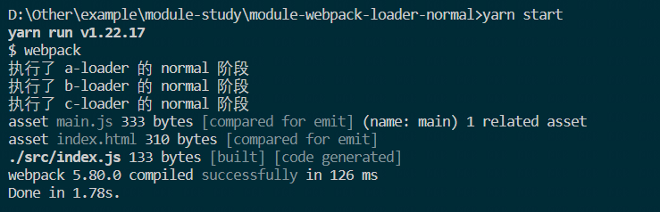

可以查看 [案例代码](https://github.com/xiexingen/module-study/tree/main/module-webpack-loader-normal)

## Pitching Loader

其实我们在导出的 Loader 函数上还有一个可选属性:`pitch`。它的值也是一个函数,该函数就被称为 [Pitching Loader](https://webpack.docschina.org/api/loaders#pitching-loader)

我们可以在这个函数中做一些事情,在 ALoader、BLoader、CLoader 这三个 Loader 中添加 pitch 函数

a-loader.js

```js
/**
 * 定义一个插入logger 信息的 loader
 * @param {*} content 源码文本内容
 * @param {*} map dev map
 * @param {*} meta 自定义信息
 * @returns
 */
function ALoader(content, map, meta) {
  console.info('执行了 a-loader 的 normal 阶段');
  return `/*这是由 a-loader 生成的内容*/\r\n${content}`;
}

ALoader.pitch = function () {
  console.log('a-loader 的 pitch 阶段');
};

module.exports = ALoader;
```

b-loader.js

```js
/**
 * 定义一个插入logger 信息的 loader
 * @param {*} content 源码文本内容
 * @param {*} map dev map
 * @param {*} meta 自定义信息
 * @returns
 */
function BLoader(content, map, meta) {
  console.info('执行了 b-loader 的 normal 阶段');
  return `/*这是由 b-loader 生成的内容*/\r\n${content}`;
}

BLoader.pitch = function () {
  console.log('b-loader 的 pitch 阶段');
  /**
   * 没有返回值的情况下执行顺序为:
   * c patch -> b patch -> a patch -> a normal -> b normal -> c normal
   * c patch -> b patch -> c normal
   */
  // return "test"
};

module.exports = BLoader;
```

c-loader.js

```js
/**
 * 定义一个插入logger 信息的 loader
 * @param {*} content 源码文本内容
 * @param {*} map dev map
 * @param {*} meta 自定义信息
 * @returns
 */
function CLoader(content, map, meta) {
  console.info('执行了 c-loader 的 normal 阶段');
  return `/*这是由 c-loader 生成的内容*/\r\n${content}`;
}

CLoader.pitch = function () {
  console.log('c-loader 的 pitch 阶段');
};

module.exports = CLoader;
```

配置完成后我们再次运行 yarn start 启动编译

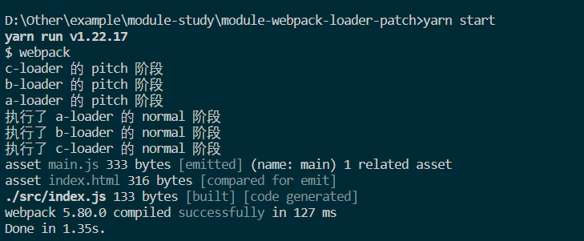

可以查看 [案例代码](https://github.com/xiexingen/module-study/tree/main/module-webpack-loader-patch)

由此,我们可以得出结论:在 Loader 的运行过程中,如果发现该 Loader 上有 pitch 属性,会先执行 pitch 阶段,再执行 normal 阶段

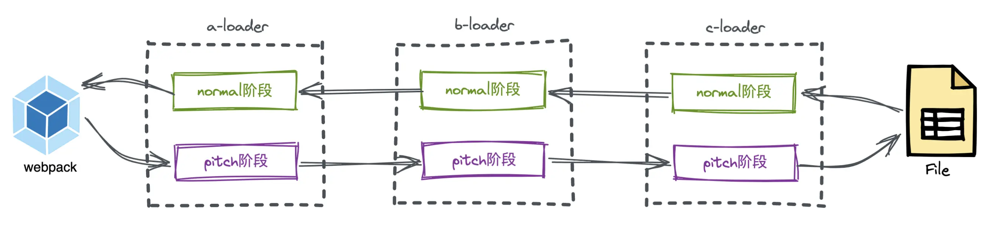

如果此时再结合上之前所讲的四种类型:[前置(pre)](https://webpack.docschina.org/configuration/module/#ruleenforce)、普通(normal)、行内(inline)、后置(post),则执行顺序为:

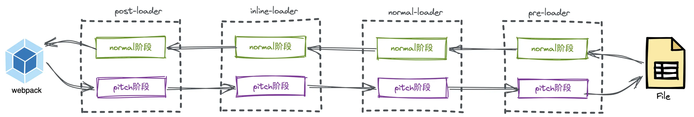

此时再看之前的结论,是不是更清晰明了

1. Pitching 阶段

Loader 上的 pitch 方法,按照 后置(post)、行内(inline)、普通(normal)、前置(pre) 的顺序调用

2. Normal 阶段

Loader 上的 常规方法,按照 前置(pre)、普通(normal)、行内(inline)、后置(post) 的顺序调用。模块源码的转换, 发生在这个阶段

举个例子:如果 BLoader 的 pitch 阶段有返回值,将直接进入到 ALoader 的 normal 阶段


b-loader.js

```js
/**
 * 定义一个插入logger 信息的 loader
 * @param {*} content 源码文本内容
 * @param {*} map dev map
 * @param {*} meta 自定义信息
 * @returns
 */
function BLoader(content, map, meta) {
  console.info('执行了 b-loader 的 normal 阶段');
  return `/*这是由 b-loader 生成的内容*/\r\n${content}`;
}

BLoader.pitch = function () {
  console.log('b-loader 的 pitch 阶段');
  /**
   * 没有返回值的情况下执行顺序为:
   * c patch -> b patch -> a patch -> a normal -> b normal -> c normal
   * c patch -> b patch -> c normal
   */
  return 'test';
};

module.exports = BLoader;
```

运行结果:

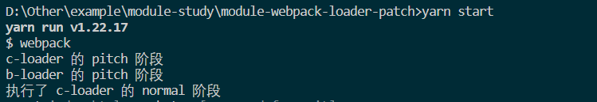

可以查看 [案例代码](https://github.com/xiexingen/module-study/tree/main/module-webpack-loader-patch)

这里可能有同学要问了,Loader 不就是为了处理文件的吗,这里文件直接都不读了,那么 Loader 的意义在哪里？

这里咱们先不急,等后面我们手写 Loader 就知道啦。

# Pitch 阶段的参数解析

PitchLoader 内部有三个很重要的参数:`PreviousRequest`、`CurrentRequest`、`remainingRequest`,它们分别代表不同纬度的 Loader 数组。

假设现有 5 个 loader 要执行（loader1、loader2、loader3、loader4、loader5）:

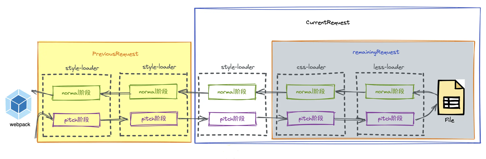

现在执行到了 loader3,那么 PreviousRequest 代表的是之前执行过 pitch 阶段的 loader:loader1 和 loader2。

CurrentRequest 代表的是当前正在执行 pitch 阶段的 loader 和后面未执行 pitch 阶段的 loader:loader3、loader4、loader5、源文件。

remainingRequest 代表未执行过 pitch 阶段的 loader:loader4、loader5、源文件。

其中 remainRequest 和 PreviousRequest 作为 pitchLoader 作为 pitch 函数的默认参数,[这里](https://webpack.js.org/api/loaders/#pitching-loader)官方有介绍

```js
Loader.pitch = function (remainingRequest, previousRequest, data) {
  console.log(remainingRequest, previousRequest, data);
};
```

这里的第三个参数 data,可以用于数据传递。即在 pitch 函数中往 data 对象上添加数据,之后在 normal 函数中通过 this.data 的方式读取已添加的数据,也就是注入上下文

```js
function loader(source) {
  console.log(this.data.a); //这里可以拿到值为1
  return source;
}

loader.pitch = function () {
  this.data.a = 1; //注入参数
  console.log('loader-pitch');
};
```

# Loader 的内联方式

在某些情况下,我们对一个类型的文件配置了多个 Loader,但只想执行特定的 Loader 怎么办？比如只想执行内联类型的 CLoader

- rule 配置

```js
rules: [
  {
    test: /\.js$/,
    use: ['a-loader'],
  },
  {
    test: /\.js$/,
    use: ['b-loader'],
    enforce: 'post',
  },
];
```

src/index.js

```js
import test from 'c-loader!./test.js'; //使用内联Loader

const a = 1;
```

a-loader.js

```js
/**
 * 定义一个插入logger 信息的 loader
 * @param {*} content 源码文本内容
 * @param {*} map dev map
 * @param {*} meta 自定义信息
 * @returns
 */
function ALoader(content, map, meta) {
  console.info('执行了 a-loader 的 normal 阶段');
  return `/*这是由 a-loader 生成的内容*/\r\n${content}`;
}

ALoader.pitch = function () {
  console.log('a-loader 的 pitch 阶段');
};

module.exports = ALoader;
```

b-loader.js

```js
/**
 * 定义一个插入logger 信息的 loader
 * @param {*} content 源码文本内容
 * @param {*} map dev map
 * @param {*} meta 自定义信息
 * @returns
 */
function BLoader(content, map, meta) {
  console.info('执行了 b-loader 的 normal 阶段');
  return `/*这是由 b-loader 生成的内容*/\r\n${content}`;
}

BLoader.pitch = function () {
  console.log('b-loader 的 pitch 阶段');
  /**
   * 没有返回值的情况下执行顺序为:
   * c patch -> b patch -> a patch -> a normal -> b normal -> c normal
   * c patch -> b patch -> c normal
   */
  // return "test"
};

module.exports = BLoader;
```

c-loader.js

```js
/**
 * 定义一个插入logger 信息的 loader
 * @param {*} content 源码文本内容
 * @param {*} map dev map
 * @param {*} meta 自定义信息
 * @returns
 */
function CLoader(content, map, meta) {
  console.info('执行了 c-loader 的 normal 阶段');
  return `/*这是由 c-loader 生成的内容*/\r\n${content}`;
}

CLoader.pitch = function () {
  console.log('c-loader 的 pitch 阶段');
};

module.exports = CLoader;
```

正常情况下,此时的运行顺序为:

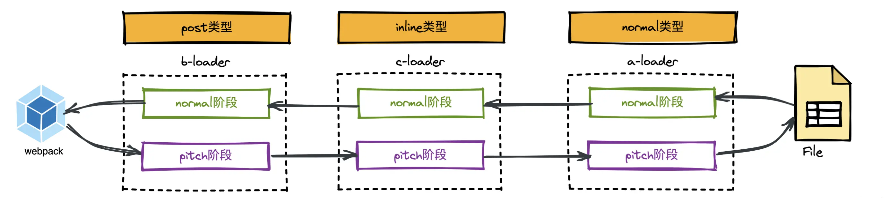

> 如果此时想指定执行某些类型的 Loader,忽略掉其他类型应该怎么办？

[使用 ! 前缀,将禁用所有已配置的 normal loader(普通 loader)](https://webpack.docschina.org/concepts/loaders/#inline)通过为内联 import 语句添加前缀:

src/index.js

```js
import test from '!c-loader!./test.js';

const a = 1;
```

此时 Loader 的执行顺序就变成了（忽略掉了 normal 类型的 ALoader）

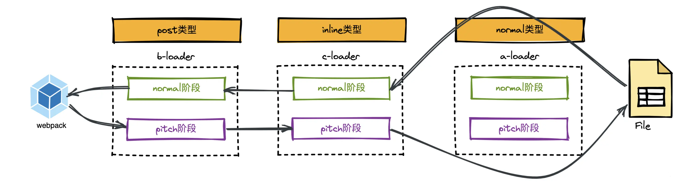

[使用 !! 前缀,将禁用其他类型的 loader,只要内联 loader](https://webpack.docschina.org/concepts/loaders/#inline):

```js
import test from '!!c-loader!./test.js';

const a = 1;
```

此时 loader 的执行顺序就变成了

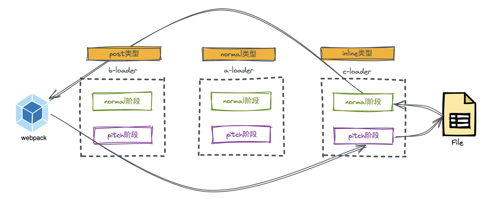

[使用 -! 前缀,将禁用所有已配置的 preLoader 和 loader,但是不禁用 postLoaders,也就是不要 pre 和 normal loader](https://webpack.docschina.org/concepts/loaders/#inline)

```js
import test from '-!c-loader!./test.js';

const a = 1;
```

此时 Loader 的执行顺序就变成了（演示中没有 preLoader）

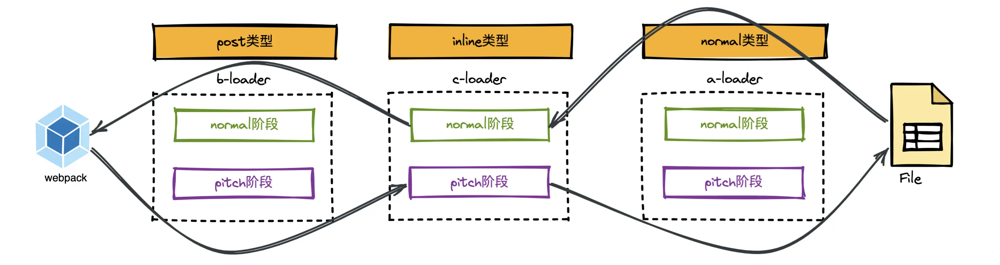

原理实现其实挺简单的:只是按标识符做了一个过滤。接下来我们通过以下代码简单了解一下其中的原理:

```js
const { runLoaders } = require('loader-runner'); //webpack内容用的此库解析loaders
const path = require('path');
const entryFile = path.resolve(__dirname, './src/index.js'); //拿到入口文件的绝对路径

//模拟使用行内loader
let modulePath = `-!inline-loader1!inline-loader2!${entryFile}`;
//模拟webpack.config.js中的配置
let rules = [
  {
    test: /\.js$/,
    use: ['normal-loader1', 'normal-loader2'], //使用两个normalLoader
  },
  {
    test: /\.js$/,
    enforce: 'post',
    use: ['post-loader1', 'post-loader2'], //使用两个postLoader
  },
  {
    test: /\.js$/,
    enforce: 'pre',
    use: ['pre-loader1', 'pre-loader2'], //使用两个preLoader
  },
];

let preLoaders = [],
  inlineLoaders = [],
  postLoaders = [],
  normalLoaders = [];

//找出 inlineLoaders
let useInlineLoadersArray = modulePath.replace(/^-?!+/, '').split('!'); //['inline-loader1','inline-loader2','入口模块的路径']
let resource = useInlineLoadersArray.pop(); //弹出最后一个元素 resource = 入口模块的路径
inlineLoaders = useInlineLoadersArray; //[inline-loader1,inline-loader2]

//对其他类型的loader进行分类
for (let i = 0; i < rules.length; i++) {
  let rule = rules[i];
  if (rule.test.test(resource)) {
    if (rule.enforce === 'pre') {
      preLoaders.push(...rule.use);
    } else if (rule.enforce === 'post') {
      postLoaders.push(...rule.use);
    } else {
      normalLoaders.push(...rule.use);
    }
  }
}

let loaders = [];

if (request.startsWith('!!')) {
  //使用 !! 前缀,将禁用其他类型的loader,只要内联loader
  loaders = [...inlineLoaders];
} else if (request.startsWith('-!')) {
  //使用 -! 前缀,将禁用所有已配置的 preLoader 和 loader,但是不禁用 postLoaders,也就是不要前置和普通 loader
  loaders = [...postLoaders, ...inlineLoaders];
} else if (request.startsWith('!')) {
  //使用 ! 前缀,将禁用所有已配置的 normal loader(普通 loader)
  loaders = [...postLoaders, ...inlineLoaders, ...preLoaders];
} else {
  loaders = [...postLoaders, ...inlineLoaders, ...normalLoaders, ...preLoaders];
}

//把loader数组从名称变成绝对路径,因为runLoaders接收的是绝对路径
loaders = loaders.map((loader) => path.resolve(__dirname, 'loaders', loader));

runLoaders(
  {
    resource, //你要加载的资源
    loaders,
  },
  (err, result) => {
    console.log(err, 'err'); //运行错误
    console.log(result, '最后要输出的result'); //运行的结果
    console.log(
      result.resourceBuffer ? result.resourceBuffer.toString('utf8') : null,
      '读到的原始的文件',
    ); //读到的原始的文件
  },
);
```

# 实现 Loader-Runner

在上面提到 Loader 的内联方式时,我们使用到了一个库:[loader-runner](https://github.com/webpack/loader-runner)。Webpack 内部也会使用该库来运行已配置的 loaders。

到现在我们已经完整的知道了 Loader 的运行机制,接下来将进一步深挖该库的源码。

loader-runner 会导出核心函数 runLoaders,runLoaders 接受两个参数:option 参数对象和执行完成后的回调函数,在回调函数的默认参数中可以查看源代码等信息

```js
import { runLoaders } from 'loader-runner';

runLoaders(
  {
    resource: '资源的绝对路径', //要解析资源的绝对路径
    loaders: ['loader的绝对路径'], //loader的绝对路径,这里可以放多个
    context: { minimize: true }, //路径上下文
  },
  function (err, result) {
    //err:错误信息 result:输出解析后的结果
  },
);
```

整体思路:

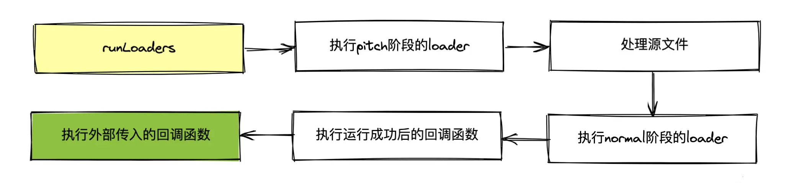

## runLoaders 基本结构

在这一步骤中主要是定义一些最基本的数据供后续使用

```js
const fs = require('fs');

//根据loader模块的绝对路径得到loader对象
function createLoaderObject(loader) {
  const normal = require(loader); //拿到normal阶段的函数
  const pitch = normal.pitch; //拿到pitch阶段的函数,可能有也可能没有
  return {
    path: loader, //loader的绝对路径
    normal,
    pitch,
    raw: normal.raw, //如果raw为true,那么normal的参数就是buffer类型
    data: {}, //每个loader对象都有一个自定义的data对象,你可以随意赋值,举个例子,在loader的pitch阶段给数据,可以在normal阶段接收
    pitchExecuted: false, //此loader的pitch函数已经执行过了吗
    normalExecuted: false, //此loader的normal函数已经执行过了吗
  };
}

function runLoaders(option, finalCallback) {
  const {
    resource,
    loaders = [], //里面放的是loader的绝对路径 【loader1的绝对路径,loader2的绝对路径】
    context = {}, //默认的上下文对象,不给的话就是一个空对象
    readResource = fs.readFile, //读文件的函数
  } = option;

  //loaderContext将会成为loader执行时的this指针。之前我们在loader中使用的this.getOptions就是在这里面拿的
  loaderContext = context; //context会成为loader执行过程中默认的的this指针
  loaderContext.resource = resource;
  loaderContext.readResource = readResource;
  loaderContext.loaders = loaders.map(createLoaderObject); //是一个数组,放着每个loader的各种信息
  loaderContext.loaderIndex = 0; //当前正在执行loader的索引,先执行pitch再执行normal阶段,都是靠索引控制的,先递增再递减,比如pitch阶段:0-1-2-3,到了normal阶段就是:3-2-1-0
  loaderContext.callback = null; //调用callback可以让当前的loader执行结束,并且向后续的loader传递多个参数
  loaderContext.async = null; //是内置方法,可以把同步变成异步

  //接下来定义属性
  //剩下的请求
  Object.defineProperty(loaderContext, 'remainRequest', {
    get() {
      return loaderContext.loaders
        .slice(loaderContext.loaderIndex + 1)
        .map((loader) => loader.path)
        .concat(loaderContext.resource)
        .join('!');
    },
  });

  //当前的请求
  Object.defineProperty(loaderContext, 'currentRequest', {
    get() {
      return loaderContext.loaders
        .slice(loaderContext.loaderIndex)
        .map((loader) => loader.path)
        .concat(loaderContext.resource)
        .join('!');
    },
  });

  //之前的请求
  Object.defineProperty(loaderContext, 'PreviousRequest', {
    get() {
      return loaderContext.loaders
        .slice(0, loaderContext.loaderIndex)
        .map((loader) => loader.path)
        .concat(loaderContext.resource)
        .join('!');
    },
  });

  //各个loader上单独定义的参数
  Object.defineProperty(loaderContext, 'data', {
    get() {
      return loaderContext.loaders[loaderContext.loaderIndex].data;
    },
  });

  //处理选项
  let processOptions = {
    resourceBuffer: null, //存放着要加载的模块的原始内容,默认为空,等文件加载后会赋值
    readResource, //读取文件的方法,默认值是fs.readFile
  };
}

module.exports.runLoaders = runLoaders;
```

## 执行 pitch 阶段的 loaders

该步骤的核心思想:

1. 如果 loaderIndex 已经大于等于 loader 的长度了,代表 pitch 阶段执行完了,可以开始读文件了（loaderContext.loaderIndex 为当前正在执行 loader 的索引,先执行 pitch 阶段再执行 normal 阶段,都是靠索引控制的,先递增再递减,比如 pitch 阶段:0-1-2-3,到了 normal 阶段就是:3-2-1-0）

2. 拿到当前的 loader,如果当前的 pitch 阶段已经执行过了,就可以让当前的索引加 1,执行下一个 loader 的 pitch 阶段

3. 拿到 pitch 函数,如果当前 loader 的 pitch 函数没有,则执行下一个 loader 的 pitch 函数

4. 如果 pitchFn 有值,以同步或者异步调用 pitchFn 方法,以 loaderContext 为 this 指针

5. 如果 pitchFn 的运行结果不为 undefined,则需要掉头执行前一个 loader 的 normal 阶段

6. 如果 pitchFn 的运行结果为 undefined,则需要执行下一个 loader 的 pitch 阶段

另外,下面的代码中有提到关于 Loader 中同步执行或异步执行的 API,这里就不给大家过多解释了,较简单,可自行查阅官网

```js
//执行pitch阶段的loaders
function iteratePitchingLoaders(
  processOptions,
  loaderContext,
  pitchingCallback
) {
  //如果loaderIndex已经大于等于loader的长度了,代表pitch阶段执行完了,开始读文件
  if (loaderContext.loaderIndex >= loaderContext.loaders.length) {
    //processResource函数8.3会写
    return processResource(processOptions, loaderContext, pitchingCallback);
  }

  //先拿到当前的loader
  const currentLoader = loaderContext.loaders[loaderContext.loaderIndex];

  //如果当前的pitch已经执行过了,就可以让当前的索引加1,执行下一个loader的pitch
  if (currentLoader.pitchExecuted) {
    loaderContext.loaderIndex++;
    return iteratePitchingLoaders(
      processOptions,
      loaderContext,
      pitchingCallback
    );
  }

  //拿到pitch函数
  let pitchFn = currentLoader.pitch;
  currentLoader.pitchExecuted = true; //不管pitch函数有没有,都把这个pitchExecuted设为true,代表执行过pitch了

  if (!pitchFn) {
    //如果当前loader的pitch函数没有,则执行下一个loader的pitch
    return iteratePitchingLoaders(
      processOptions,
      loaderContext,
      pitchingCallback
    );
  }

  //如果pitchFn有值,以同步或者异步调用pitchFn方法,以loaderContext为this指针
  runSyncOrAsync(
    pitchFn,
    loaderContext,
    [
      loaderContext.remainRequest,
      loaderContext.PreviousRequest,
      loaderContext.data,
    ], //这里是给pitchFn传的参数
    (err, ...args) => {
      //判读有没有返回值 args就是返回值,就需要掉头执行前一个loader的normal阶段
      if (args.length > 0 && args.some((item) => item)) {
        loaderContext.loaderContext--;
        //这个函数在8.4中会写
        iterateNormalLoader(
          processOptions,
          loaderContext,
          args,
          pitchingCallback
        );
      } else {
        //如果没有return 就执行下一个loader的pitch
        iteratePitchingLoaders(processOptions, loaderContext, pitchingCallback);
      }
    }
  );
}

function runSyncOrAsync(pitchFn, loaderContext, args, runCallback) {
  let isSync = true; //默认loader的执行是同步的
  let isDone = false; //是否执行完成
  loaderContext.callback = (err, ...args) => {
    if (isDone) {
      //为了保证runCallback只调用一次,不能重复执行
      throw new Error("this callback已经执行完成了");
    }
    isDone = true;
    runCallback(err, ...args);
  };
  loaderContext.async = () => {
    isSync = false; //把isSync是否同步执行的标志 从同步变成异步
    //this.async()返回的结果就是this.callback,他们是一样的
    return loaderContext.callback;
  };
  let result = pitchFn.apply(loaderContext, args);

  //如果是同步的,由本方法直接调用runCallback,用来执行下一个loader
  if (isSync) {
    isDone = true;
    runCallback(null, result);
  }
  //如果是异步的,需要自己手动出发callback 也就是runCallback
}


function runLoaders(option, finalCallback) {
  //省略8.1中的代码

  //开始从左向右遍历loader的pitch方法
+  iteratePitchingLoaders(processOptions, loaderContext, (err, result) => {
+    finalCallback(err, {
+      result,
+      resourceBuffer: processOptions.resourceBuffer,
+    });
+  });
}
```

## 处理源文件

该步骤的核心思想:拿到源文件后将其传给 normal 阶段的第一个 Loader

```js
//处理文件
function processResource(processOptions, loaderContext, pitchingCallback) {
  processOptions.readResource(loaderContext.resource, (err, resourceBuffer) => {
    processOptions.resourceBuffer = resourceBuffer; //拿到源文件的buffer
    loaderContext.loaderIndex--; //减1后会开始执行normal阶段的loader
    //8.4会写该函数
    iterateNormalLoader(
      processOptions,
      loaderContext,
      [resourceBuffer],
      pitchingCallback,
    );
  });
}
```

## 执行 normal 阶段的 loader

该步骤的核心思想:遍历执行 normal 阶段的函数,如果 loaderContext.loaderIndex < 0,代表 normal 阶段的 loader 已经全部执行完成,开始执行成功的回调函数

```js
//执行normal阶段的loader
function iterateNormalLoader(
  processOptions,
  loaderContext,
  args,
  pitchingCallback,
) {
  //代表normal阶段的loader已经全部执行完成
  if (loaderContext.loaderIndex < 0) {
    return pitchingCallback(null, args);
  }
  //获取当前正在执行的loader
  const currentLoader = loaderContext.loaders[loaderContext.loaderIndex];

  if (currentLoader.normalExecuted) {
    loaderContext.loaderIndex--;
    return iterateNormalLoader(
      processOptions,
      loaderContext,
      args,
      pitchingCallback,
    );
  }

  //拿到normal函数
  let normalFn = currentLoader.normal;
  currentLoader.normalExecuted = true;
  //一般loader里拿到的source都是字符串,但是如果要加载一些图片字体之类的,它需要接收一个buffer,这个时候用户可以自定义接收的数据类型是string还是buffer,默认是string
  //loader.raw=true 这么设置代表需要的是buffer数据类型
  //这里需要处理一下参数
  convertArgs(args, currentLoader.raw);

  runSyncOrAsync(normalFn, loaderContext, args, (err, ...returnArgs) => {
    if (err) return pitchingCallback(err);

    return iterateNormalLoader(
      processOptions,
      loaderContext,
      returnArgs,
      pitchingCallback,
    );
  });
}

function convertArgs(args, raw) {
  if (raw && !Buffer.isBuffer(args[0])) {
    //如果需要buffer 但原来接收的不是buffer,则转buffer
    args[0] = Buffer.from(args[0]);
  } else if (!raw && Buffer.isBuffer(args[0])) {
    //如果不需要buffer 但是它是buffer 则转字符串
    args[0] = args[0].toString('utf8');
  }
}
```

## 执行最终回调函数

```js
function runLoaders(option, finalCallback) {
  //省略其他代码

  //开始从左向右遍历loader的pitch方法
  iteratePitchingLoaders(processOptions, loaderContext, (err, result) => {
    //这里执行外面传进来的回调函数
    finalCallback(err, {
      result,
      resourceBuffer: processOptions.resourceBuffer,
    });
  });
}
```

# 实战演练

## 手写 babel-loader

如果不太熟悉 [babel](https://www.npmjs.com/package/babel-loader) 的同学,可以前往看 AST

先安装 babel 的一系列依赖

```js
yarn add @babel/core @babel/preset-env
```

[babel-loader](https://www.npmjs.com/package/babel-loader) 做的事情其实很简单,只需将 Loader 中的源代码交给 babel 库处理,拿到处理过后的值返回,仅此而已

webpack.config.js

```js
rules: [
  {
    test: /\.js$/,
    use: [
      {
        loader: "my-babel-loader",
        options: {
          presets: ["@babel/preset-env"],
        },
      },
    ],
  },
],
```

src/index.js

```js
export const sum = (num1, num2) => num1 + num2; //这里是个箭头函数,需要通过loader转换成普通函数
sum(1, 2);
```

loaders/my-babel-loader.js

```js
const babel = require('@babel/core');
const path = require('path');

function miniBabelLoader(source) {
  // loade 里面的 this=loaderContext 是一个唯一的对象,不管在哪个loader或方法里,它的this都是同一个对象,称为loaderContext
  const options = this.getOptions(); //拿到在 webpack 中传递给该loader的参数,也就是presets: ["@babel/preset-env"],
  console.log('自己写的 mini-babel-loader');
  const { code } = babel.transformSync(source, options); //交给 babel 库去解析
  return code;
}

module.exports = miniBabelLoader;
```

解释一下上面的代码:

[@babel/core](https://www.npmjs.com/package/@babel/core) 负责把源代码转成 AST 抽象语法树,然后遍历语法树,生成新代码,但@babel/core 并不认识任何具体的语法,也不会转换任何语法,它需要依赖 babel 插件。比如[@babel/plugin-transform-arrow-functions](https://www.npmjs.com/package/@babel/plugin-transform-arrow-functions) 可以识别箭头函数语法,并且把箭头函数转换成普通函数。

但是因为语法太多,每个语法都需要插件,我们需要把多个插件打包在一起形成预设,[@babel/preset-env](https://www.npmjs.com/package/@babel/preset-env) 就是这样诞生的。

现在再查看效果:源代码中的箭头函数已经被转换成普通函数

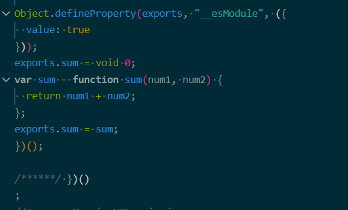

可以查看 [案例代码](https://github.com/xiexingen/module-study/tree/main/module-webpack-loader-use-babel-loader)

## 手写 less-loader

在开发换环境下,我们对 .less 文件解析时一般会用到三个 Loader :[less-loader](https://www.npmjs.com/package/less-loader)、[css-loader](https://www.npmjs.com/package/css-loader)、[style-loader](https://www.npmjs.com/package/style-loader)

先安装依赖

```js
yarn add less -D
```

src/index.js 使用 less

```js
import './index.less';
```

src/index.less

```css
@primary: red;

body {
  background-color: @primary;
}
```

webpack.config.js

```js
const path = require('path');

// CommonJS 的写法
module.exports = {
  mode: 'development', // 开发环境,不压缩代码
  entry: './src/index.js', // 配置入口文件,跟很多后端一样 习惯叫 main
  devtool: 'source-map', // 方便查看打包后的代码
  output: {
    filename: 'main.js', //定义打包后的文件名称
    path: path.resolve(__dirname, './dist'), //必须是绝对路径
  },
  resolveLoader: {
    // 找 loader 的时候,先去 loaders 目录下找,找不到再去 node_modules 下面找
    modules: ['loaders', 'node_modules'],
  },
  module: {
    rules: [
      {
        test: /\.less$/,
        use: [
          'my-style-loader', //将 css 内容变成 style 标签插入到 html 中去
          'my-css-loader', //一般会解析url合 @import 等语法
          'my-less-loader', //将 less => css
        ],
      },
    ],
  },
};
```

整体流程图

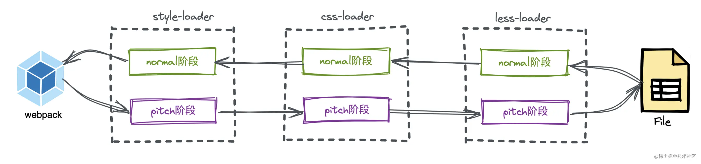

这里因为没有 pitch 阶段,所以就是将源文件交给 less-loader 处理,然后交给 css-loader 处理,最后再给 style-loader 处理

less-loader 实现思路:调用 [less](https://www.npmjs.com/package/less) 库将 .less 源代码转换为 .css 文件即可

loaders/my-less-loader.js

```js
const less = require('less');
const path = require('path');

// 参数 source 是 less 文件的内容
function lessLoader(lessSource) {
  let css;
  //这里less.render其实也就是把less解析成AST,然后再生成css
  less.render(lessSource, { filename: this.resource }, (err, output) => {
    css = output.css;
  });
  return css;
}

module.exports = lessLoader;
```

## 手写 css-loader

[css-loader](https://www.npmjs.com/package/css-loader) 其实它的核心会做两件事:

解析@import 语法
解析 url 中的路径
这里我们不展开,只做一个返回即可。

loaders/my-css-loader.js

```js
const less = require('less');
const path = require('path');

// 这里我们啥也没干直接返回
function cssLoader(cssSource) {
  return cssSource;
}

module.exports = cssLoader;
```

## 手写 style-loader

[style-loader](https://www.npmjs.com/package/style-loader)会接收 css-loader 返回的代码,它需要返回一段 js,这点很重要！！！

因为 Webpack 只认识 js 和 json,因此最左侧的 Loader 必须返回的是 js 代码

实现思路:`创建一个 style 标签,将css代码添加到 head 中去`

my-style-loader.js

```js
const less = require('less');
const path = require('path');

// 因为 Webpack 只认识 js 和 json ,因此最左侧的 Loader 必须返回的是 js 代码
// 实现思路:创建一个 style 标签,将 css 代码添加到 head 中去
function styleLoader(cssSource) {
  let script = `
  let style=document.createElement("style");
  style.innerHTML=${JSON.stringify(cssSource)};
  document.head.appendChild(style)
`;
  return script;
}

module.exports = styleLoader;
```

打包之后查看效果


可以查看 [案例代码](https://github.com/xiexingen/module-study/tree/main/module-webpack-loader-use-less-loader)

## 真实源码中的做法

通过上面的几个例子,我们已经大致了解这几个 Loader 的工作原理,但真实的源码中真的也是这么做的吗？

在真正的源码中,less-loader 返回的还是 css 代码,而 css-loader 返回的却是 js 代码:

```js
function cssLoader(css) {
  return `module.exports=${JSON.stringify(css)}`;
}

module.exports = cssLoader;
```

这个时候 style-loader 再像我们上面那样实现就有问题了:因为 style-loader 需要接收的是 css 代码,而此时上一个 Loader（css-loader）返回的是 js 代码

这个时候该怎么办呢？是不是就不能配合使用了？

### 改造 style-loader

既然 css-loader 返回的是 js,那我们直接将 js 转换成 css 不就好了吗？

思路:style-loader 接收的是这么一个字符串:module.exports="#root{color:red}",我们只需要将 = 号后面的内容解析出来即可。

```js
function styleLoader(cssSource) {
  let css = cssSource.match(/module.exports="(.+?)"/)[1]; //通过正则解析出等号后面的内容
  let script = `
  let style=document.createElement("style");
  style.innerHTML=${JSON.stringify(css.replace('\n', '0'))}; // 剔除换行符
  document.head.appendChild(style)
  `;

  return script;
}
```

这样虽然能解决问题,但是如果 css-loader 不是通过 module.exports 的方式导出的,而是通过其他的方式导出的,那我们这里是不是都得跟着变换？而且这样通过正则匹配的方式也并不一定准确,万一源代码中也有 module.exports 这样的关键字怎么办？

因此,这样虽然能够解决问题,但是却并不优雅

### style-loader 的 pitch

css-loader 是通过 module.exports 方式导出的,而且我们正好也需要接收 css 字符串,那是不是可以直接通过 require 的方式接收呢？

接下来就有点巧妙了,源码中通过在 pitch 阶段进行 require,然后返回 script:

```js
styleLoader.pitch = function () {
  let script = `
  let style=document.createElement("style");
  style.innerHTML=require("!!../loaders/css-loader.js!../loaders/less-loader.js!./index.less");
  document.head.appendChild(style)
`;
  return script;
};
```

注意！在 require 的时候使用的是行内（inline） Loader！！！

这下整个流程就变了,如果在 pitch 阶段如果有返回值,将会执行上一个 Loader 的 Normal 阶段

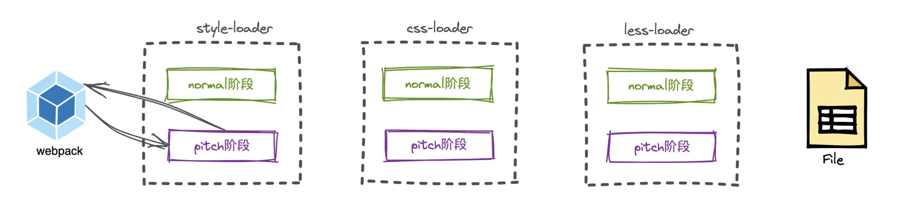

而 style-loader 的上一个 loader 压根就没有了,因此直接退出 loader 解析阶段,将此段代码重新交给 Webpack 进行 AST 树解析。当在对这段代码中发现了 require 等关键字后,会将 require 后面的路径放到依赖树中,等该模块解析完后再对依赖模块进行解析。

这个时候有同学可能要问了,你这编译个啥啊,又没读文件,又没有使用 css-loader 和 less-loader。

这位同学请你坐下,稍安勿躁,可看仔细了,我们在 require 的时候,使用的可是行内（inline） Loader,!!代表只使用行内（inline）Loader。

Webpack 在对 require("!!../loaders/css-loader.js!../loaders/less-loader.js!./index.less")进行解析时,走的是这个逻辑:

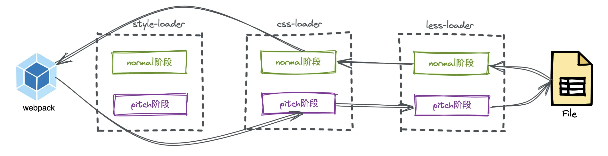

最后返回的内容是 module.exports="#root{color:red}",在 style-loader 的 pitch 阶段正好被接收,而且拿到的正好也是 css 字符串代码。

过程完整梳理:

这里其实是走了两轮编译,在第一次对 index.less 进行解析时,会先走到 style-loader 的 pitch 函数下。在该函数内会 return 一个 script。在这一轮解析完后,会 return 后的内容进行 AST 分析,也就是对下面这段代码进行分析:

```js
let style = document.createElement('style');
style.innerHTML = require('!!../loaders/css-loader.js!../loaders/less-loader.js!./index.less');
document.head.appendChild(style);
```

当发现代码中有 require 关键字后,放到本模块的依赖中。当本次编译结束后,开始编译它的依赖模块,也就是!!../loaders/css-loader.js!../loaders/less-loader.js!./index.less,在新的一轮中还是先进行 loader 解析,此时 loader 解析器发现这是一个 行内（inline）Loader,并且还使用 !! 前缀,代表将禁用所有已配置的,只要内联 loader,也就是只执行 less-loader 和 css-loader,此时的执行顺序变为了:


因为 css-loader 和 less-loader 没有 pitch 阶段,因此只走了后面的逻辑,即将源文件交给 less-loader 和 css-loader 执行,此时 less-loader 解析后返回 css,css-loader 解析后返回:

```js
module.exports = '#root{color:red}';
```

## 为什么要这么处理

当我们希望把两个 Loader 进行联合使用的时候,就需要使用这种方式。因为 css-loader 返回的是 js 文本,但 style-loader 要的是 css 文本,只能用 require 加载这个 js 文件模块,得到导出结果才是 css 代码。

使用 pitch 之后还有一个好处,那就是 css-loader 可以单独使用或配合其他 Loader 进行使用了,因为 Webpack 最左侧的 Loader 必须是 js,如果返回的是 css 代码那将不能单独使用,这样可以不依赖 style-loader

# 总结

本文从 Loader 的本质出发,讲解了如何在 Webpack 中写自定义 Loader 以及多种使用方式,接着透过 Loader 运行顺序的问题衍生出 Loader 的四种类型、Normal Loader 和 Pitch Loader。最后,我们深挖 Loader 的运行机制,使得我们可以任意控制执行指定的 Loader (如何一个文件指定了多个 Loader )。

在深度上,我们也手写了 loader-runner 源码,并对常用的 babel-loader、less-loader、css-loader、style-loader 等几个 Loader 进行了源码方面的探索,进一步加深大家对理解。
