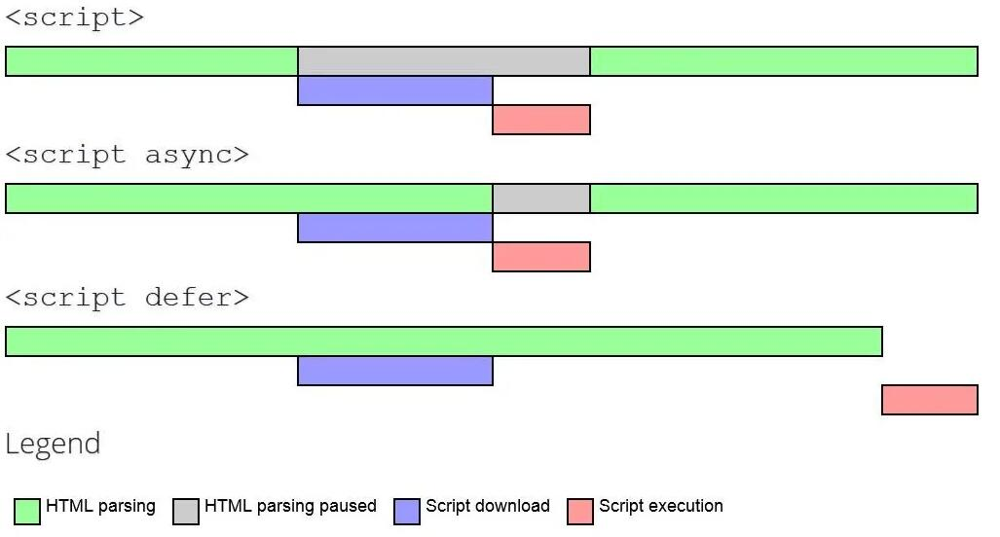
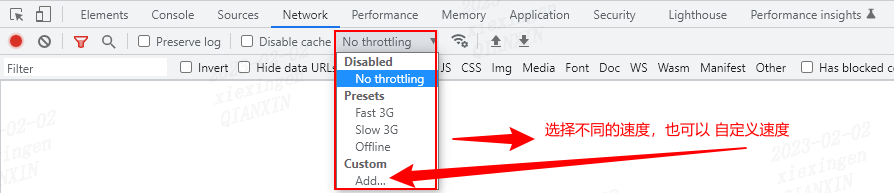

## 问题

- 字体/图片/视频 会不会阻塞页面加载
- CSS/JS 是如何阻塞页面加载的
- JS 是否会阻塞 DOM 的加载
- defer 和 async 有什么作用
- 动态脚本会不会造成阻塞
- 阻塞是怎么和 DOMContentLoaded 与 onload 扯上关系的
- 如何用 Chrome 定制网络加载速度

## 图片加载

案例中的图片有 152kb，我们可以吧网络下载速度限制成 100kb/s，打开该页面
可以看到如下结果：当 h1 和 h2 标签渲染出来且打印了 DOMContentLoaded 的时候，此时图片还在加载中，这就说明了图片并不会阻塞 DOM 的加载，更加不会阻塞页面渲染；当图片加载完成的时候，会打印 onload，说明图片延迟了 onload 事件的触发

浏览器是从上往下解析的，遇到 视频、字体和图片等资源会通过网络进程去下载，不会阻塞 DOM 的加载和渲染。

<code src="./demo/image-loader.tsx" />

## css 加载

案例中使用了 bootstrap 的 cdn 样式，大小有 30kb，我们可以吧网络下载速度限制成 10kb/s，打开该页面
在调试面板下的 Elements 面板下，可以看到如下结果: bootstrap 的 CSS 文件还在加载，h1 已经加载出来了(但是页面上并没显示出来)，等 bootstrap 的 CSS 样式加载完成后，h1 标签才展示出来

得出的结论为: CSS 不会阻塞 DOM 的解析，但是会阻塞 DOM 的渲染

浏览器是从上往下解析的，遇到 视频、字体和图片等资源会通过网络进程去下载，不会阻塞 DOM 的加载和渲染。

附上一张来自互联网上的图：

我们可以看到，浏览器首先解析 HTML 生成 DOM 树，解析 CSS 生成 CSSDOM 树，然后 DOM 树和 CSSDOM 树进行合成生成渲染树，通过渲染树进行布局并且计算每个节点信息，绘制页面，可以说解析 DOM 和 解析 CSS 其实是并列进行的，既然是并列进行的，那 CSS 和 DOM 就不会互相影响，另外渲染页面一定是在得到 CSSDOM 树之后进行的

### 总结

1. CSS 阻塞 DOM 的 `渲染` 只阻塞定义在 CSS 后面的 DOM
2. CSS 会阻塞定义在其 `之后` 的 JS 的执行

所以，部分优化场景

- 样式放 head 中
  如果 css 放 body 中，二次渲染会对用户造成不好的体验且加重了浏览器的负担

### 案例

在演示案例的过程中，为了更好查看效果，先将 NetWork 面板的网络限制成 50kbit/s

#### css 放 head 中

<code src="./demo/css-loader-head.tsx" />

#### css 放 body 标签中

<code src="./demo/css-loader-body.tsx" />

#### css 对后面 js 的影响

<code src="./demo/css-effect-js.tsx" />

## js 的加载

### 总结

- script 会阻塞其之后的 HTML 的解析，只有下载好并执行完脚本才会继续解析 HTML
- script 的 async 属性，解析 HTML 的过程中同时进行脚本的下载，下载完成会立马执行，执行过程会阻塞 HTML 的解析
- script 的 defer 属性，完全不会阻塞 HTML 的解析，遇到 script 会异步下载，在 HTML 解析完成在按顺序执行脚本

### 图解

附上一张来自互联网上的图：

defer 和 async 都只能用于外部脚本，如果 script 没有 src 属性，则会忽略它们

### 案例

#### js 放 head 标签中

<code src="./demo/js-loader-head.tsx" />

#### js 放 body 标签中

<code src="./demo/js-loader-body.tsx" />

#### script async

<code src="./demo/js-loader-async.tsx" />

#### script defer

<code src="./demo/js-loader-defer.tsx" />

## chrome 调试技巧

有时候想模拟下弱网环境下的加载看看效果，怎么办？浏览器为我们提供了网络限制的功能,具体操作步骤

F12 调出开发者工具 --> 切换到 NetWork 面板 --> Disable cache 后面选择下拉框去切换不同的网速(也可以自定义)

