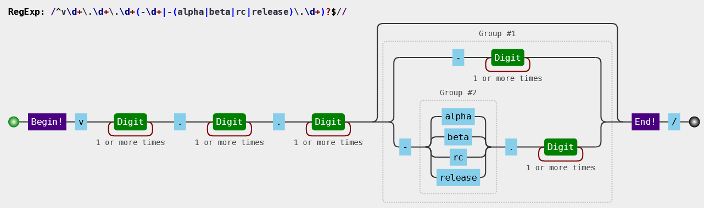

# git 规范

## Branch 规范

命名规则： `项目类型/项目版本`

`develop` `、release` `、feature` `、hotfix`

例：`release/1.0.0.1000`、`feature/1.1.0`、 `hotfix/1.0.0.1000`

## Tag 规范

tag 遵循 [semver](https://www.npmjs.cn/misc/semver/) 规范

```bash
/^v\d+\.\d+\.\d+(-\d+|-(alpha|beta|rc|release)\.\d+)?$/
示例如下:
- v1.3.0
- v1.3.1-24
- v1.3.2-alpha.2
- v1.3.3-rc.3
```



> 已经发布的 tag，是不允许在 gitlab 删除的（因为会基于 tag 拉出新的分支），所以强烈建议在仓库的 设置 > 仓库 > Protected Tags 对 tag 设置保护，避免被意外的删除。

## Commit 日志规范

格式化的 Commit message，有几个好处。

- 提供更多的历史信息，方便快速浏览。
- 可以过滤某些 commit（比如文档改动），便于快速查找信息。
- 可以直接从 commit 生成 Change log。
- 所以提交信息一定要认真填写！

现在使用的 Commit 规范检查如下： /^(revert: )?(feat|fix|docs|style|refactor|test|chore|perf|build|workflow|ci):(.+)? .{1,50}/

建议参考规范：

```bash
<type>：<Task ID> <subject>
<BLANK LINE>
<body>
<BLANK LINE>
<footer>
```

也可以简单写成` <type>：<Task ID> <subject>` (body、scope 与 footer 允许省略)

例如：fix：TCTPFRAMEWORD-123 修复 xxx Bug

⚠️ 注意， type 后的冒号为英文冒号，且冒号后有一个空格！

type 表示本次修改的动作类型，可分为：

feat：新增 xxx 功能
fix：修复 xxx Bug
docs：变更 xxx 文档
style：变更 xxx 代码格式或注释，注意不是 css 修改
refactor：重构 xxx 功能或方法
test: 更新测试代码
chore: 构建过程或辅助工具的变动
perf: 性能优化（不涉及功能变更）
build: 建议使用 chore
workflow: 建议使用 chore
ci: 建议使用 chore
Task ID: CMMI 的要求是需求、代码可跟踪，所有的改动都应该有 Task 任务来进行跟踪，所以有相关问题的 Task 号，需要在这里加上，方便回溯。

## Commit & Merge Request 规范

因为 Changelog 的生成是按 Commit 记录生成的，所以建议故事的开发和 BUG 的修复都在单独分支进行，

代码可以先 Commit 到本地，一次性完成后，需要提测时再执行 merge 到迭代分支的操作，merge 时可以考虑对 commit msg 进行合并。

这样提测构建出来的 changelog 才准确，不会有冗余信息。

> 本文章摘自奇安信开发规范文档
